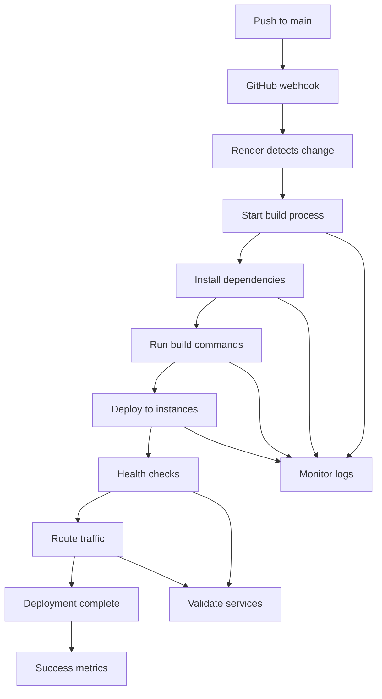

# 📊 Auto-Deployment Monitoring & Validation

**Purpose:** Monitor GitHub → Render auto-deployment in real-time  
**Duration:** 8-12 minutes typical deployment time  
**Critical Period:** First 30 minutes post-deployment

## 🚀 Deployment Flow Monitoring

### GitHub → Render Auto-Deploy Pipeline


## 📋 Real-Time Monitoring Checklist

### Phase 1: GitHub Push (0-1 min)
- [ ] **Git push successful** - Check GitHub shows latest commit
- [ ] **Webhook triggered** - Render dashboard shows "Deploying"
- [ ] **Build started** - Both backend and frontend builds initiated
- [ ] **No webhook errors** - GitHub webhook delivery successful

```bash
# Monitor GitHub webhook
curl -H "Authorization: token $GITHUB_TOKEN" \
  "https://api.github.com/repos/yourusername/homeverse/hooks"

# Check latest commit
git log --oneline -1
```

### Phase 2: Build Process (1-6 min)

#### Backend Build Monitoring
- [ ] **Dependencies installing** - `pip install` running
- [ ] **Requirements satisfied** - All packages installed successfully
- [ ] **Python compilation** - No syntax errors
- [ ] **Environment variables loaded** - All required vars present
- [ ] **Build completion** - Exit code 0

```bash
# Watch backend build logs
curl -H "Authorization: Bearer $RENDER_API_KEY" \
  "https://api.render.com/v1/services/$BACKEND_SERVICE_ID/builds" | jq '.[-1].logs'
```

#### Frontend Build Monitoring  
- [ ] **npm install running** - Dependencies downloading
- [ ] **Next.js build starting** - Build process initiated
- [ ] **TypeScript compilation** - No type errors
- [ ] **Static optimization** - Pages pre-rendered
- [ ] **Build artifacts created** - .next folder generated

```bash
# Watch frontend build logs
curl -H "Authorization: Bearer $RENDER_API_KEY" \
  "https://api.render.com/v1/services/$FRONTEND_SERVICE_ID/builds" | jq '.[-1].logs'
```

### Phase 3: Deployment (6-8 min)
- [ ] **Containers starting** - New instances launching
- [ ] **Health checks passing** - `/health` endpoints responding
- [ ] **Database connections** - Supabase connectivity verified
- [ ] **Redis connections** - Rate limiting storage available
- [ ] **Environment validation** - All variables loaded correctly

### Phase 4: Traffic Routing (8-10 min)
- [ ] **Load balancer updated** - Traffic routing to new instances
- [ ] **Old instances drained** - Previous version gracefully stopped
- [ ] **SSL certificates** - HTTPS working correctly
- [ ] **CDN updated** - Static assets serving from new build
- [ ] **DNS propagation** - Domain resolving to new deployment

## 🔍 Automated Monitoring Scripts

### Real-Time Deployment Monitor
```python
# deployment_monitor.py
import asyncio
import aiohttp
import json
import time
from datetime import datetime

class DeploymentMonitor:
    def __init__(self):
        self.backend_url = "https://homeverse-api.onrender.com"
        self.frontend_url = "https://homeverse-frontend.onrender.com"
        self.start_time = datetime.now()
        self.checks_passed = 0
        self.total_checks = 0
        
    async def monitor_deployment(self, duration_minutes=30):
        """Monitor deployment for specified duration"""
        
        print(f"🚀 Starting deployment monitoring for {duration_minutes} minutes...")
        print(f"Backend: {self.backend_url}")
        print(f"Frontend: {self.frontend_url}")
        print("-" * 60)
        
        end_time = time.time() + (duration_minutes * 60)
        
        while time.time() < end_time:
            await self.run_health_checks()
            await self.check_security_features()
            await self.validate_ui_features()
            
            # Check every 30 seconds
            await asyncio.sleep(30)
            
        print(f"\n✅ Monitoring complete!")
        print(f"Success rate: {(self.checks_passed/self.total_checks*100):.1f}%")
        
    async def run_health_checks(self):
        """Basic health and availability checks"""
        
        async with aiohttp.ClientSession() as session:
            # Backend health
            try:
                async with session.get(f"{self.backend_url}/health", timeout=10) as response:
                    if response.status == 200:
                        data = await response.json()
                        status = data.get("status", "unknown")
                        self.log_check("Backend Health", status == "healthy")
                        
                        # Detailed service checks
                        services = data.get("services", {})
                        for service, health in services.items():
                            self.log_check(f"Backend {service.title()}", health == "healthy")
                    else:
                        self.log_check("Backend Health", False, f"HTTP {response.status}")
                        
            except Exception as e:
                self.log_check("Backend Health", False, str(e))
            
            # Frontend health
            try:
                async with session.get(f"{self.frontend_url}/health", timeout=10) as response:
                    self.log_check("Frontend Health", response.status == 200)
                    
            except Exception as e:
                self.log_check("Frontend Health", False, str(e))
            
            # API connectivity from frontend
            try:
                async with session.get(f"{self.frontend_url}/api/test", timeout=10) as response:
                    self.log_check("Frontend→Backend", response.status == 200)
                    
            except Exception as e:
                self.log_check("Frontend→Backend", False, str(e))
    
    async def check_security_features(self):
        """Validate security features are working"""
        
        async with aiohttp.ClientSession() as session:
            # Test rate limiting
            rate_limit_triggered = False
            for i in range(8):  # Exceed 5/min limit
                try:
                    async with session.post(
                        f"{self.backend_url}/api/v1/auth/login",
                        json={"email": "test@test.com", "password": "wrong"},
                        timeout=5
                    ) as response:
                        if response.status == 429:  # Rate limited
                            rate_limit_triggered = True
                            break
                except Exception:
                    pass
                    
            self.log_check("Rate Limiting", rate_limit_triggered)
            
            # Test PII encryption endpoint
            try:
                async with session.post(
                    f"{self.backend_url}/api/v1/test-encryption",
                    json={"test_data": "sensitive_info"},
                    timeout=5
                ) as response:
                    self.log_check("PII Encryption", response.status == 200)
                    
            except Exception as e:
                self.log_check("PII Encryption", False, str(e))
            
            # Test CORS configuration
            try:
                async with session.options(
                    f"{self.backend_url}/api/v1/health",
                    headers={"Origin": "https://malicious-site.com"}
                ) as response:
                    # Should reject unauthorized origins
                    cors_secure = "Access-Control-Allow-Origin" not in response.headers
                    self.log_check("CORS Security", cors_secure)
                    
            except Exception as e:
                self.log_check("CORS Security", False, str(e))
    
    async def validate_ui_features(self):
        """Check UI/UX features are working"""
        
        from playwright.async_api import async_playwright
        
        try:
            async with async_playwright() as p:
                browser = await p.chromium.launch(headless=True)
                
                # Test desktop
                desktop_page = await browser.new_page()
                await desktop_page.goto(self.frontend_url, timeout=30000)
                desktop_loaded = await desktop_page.is_visible("body")
                self.log_check("Desktop UI", desktop_loaded)
                
                # Test mobile responsiveness
                mobile_page = await browser.new_page()
                await mobile_page.set_viewport_size({"width": 375, "height": 667})
                await mobile_page.goto(self.frontend_url, timeout=30000)
                
                # Check for horizontal scroll
                has_horizontal_scroll = await mobile_page.evaluate("""
                    () => document.documentElement.scrollWidth > window.innerWidth
                """)
                self.log_check("Mobile Responsive", not has_horizontal_scroll)
                
                # Test mobile menu
                menu_button = await mobile_page.query_selector(".mobile-menu-button")
                mobile_menu_exists = menu_button is not None
                self.log_check("Mobile Menu", mobile_menu_exists)
                
                await browser.close()
                
        except Exception as e:
            self.log_check("UI Validation", False, str(e))
    
    def log_check(self, check_name, passed, error=None):
        """Log check result with timestamp"""
        self.total_checks += 1
        if passed:
            self.checks_passed += 1
            
        timestamp = datetime.now().strftime("%H:%M:%S")
        status = "✅" if passed else "❌"
        error_msg = f" ({error})" if error else ""
        
        print(f"{timestamp} {status} {check_name:<20} {error_msg}")

# Run monitoring
async def main():
    monitor = DeploymentMonitor()
    await monitor.monitor_deployment(30)  # Monitor for 30 minutes

if __name__ == "__main__":
    asyncio.run(main())
```

### Quick Health Check Script
```bash
#!/bin/bash
# quick_health_check.sh

echo "🔍 Quick Deployment Health Check"
echo "================================"

BACKEND_URL="https://homeverse-api.onrender.com"
FRONTEND_URL="https://homeverse-frontend.onrender.com"

# Check backend health
echo "Checking backend health..."
BACKEND_STATUS=$(curl -s -o /dev/null -w "%{http_code}" "$BACKEND_URL/health")
if [ "$BACKEND_STATUS" = "200" ]; then
    echo "✅ Backend: Healthy"
else
    echo "❌ Backend: Failed (HTTP $BACKEND_STATUS)"
fi

# Check frontend health
echo "Checking frontend health..."
FRONTEND_STATUS=$(curl -s -o /dev/null -w "%{http_code}" "$FRONTEND_URL/health")
if [ "$FRONTEND_STATUS" = "200" ]; then
    echo "✅ Frontend: Healthy"
else
    echo "❌ Frontend: Failed (HTTP $FRONTEND_STATUS)"
fi

# Test rate limiting
echo "Testing rate limiting..."
RATE_LIMITED=false
for i in {1..8}; do
    RESPONSE=$(curl -s -o /dev/null -w "%{http_code}" \
        -X POST "$BACKEND_URL/api/v1/auth/login" \
        -H "Content-Type: application/json" \
        -d '{"email":"test@test.com","password":"wrong"}')
    
    if [ "$RESPONSE" = "429" ]; then
        RATE_LIMITED=true
        break
    fi
done

if [ "$RATE_LIMITED" = true ]; then
    echo "✅ Rate Limiting: Working"
else
    echo "❌ Rate Limiting: Not working"
fi

# Test CORS
echo "Testing CORS security..."
CORS_RESPONSE=$(curl -s -H "Origin: https://malicious-site.com" \
    -H "Access-Control-Request-Method: POST" \
    -X OPTIONS "$BACKEND_URL/api/v1/health")

if echo "$CORS_RESPONSE" | grep -q "Access-Control-Allow-Origin"; then
    echo "❌ CORS: Too permissive"
else
    echo "✅ CORS: Properly restricted"
fi

echo "================================"
echo "Health check complete!"
```

## 📱 Mobile Deployment Validation

### Mobile-Specific Checks
```javascript
// mobile_validation.js (runs in browser)
async function validateMobileDeployment() {
    const results = {
        viewport: window.innerWidth,
        hasHorizontalScroll: document.documentElement.scrollWidth > window.innerWidth,
        mobileMenuExists: !!document.querySelector('.mobile-menu-button'),
        touchTargetsValid: true,
        loadTime: performance.timing.loadEventEnd - performance.timing.navigationStart
    };
    
    // Check touch target sizes
    const interactiveElements = document.querySelectorAll('button, a, input');
    for (const element of interactiveElements) {
        const rect = element.getBoundingClientRect();
        if (rect.width < 44 || rect.height < 44) {
            results.touchTargetsValid = false;
            break;
        }
    }
    
    // Check Core Web Vitals
    const observer = new PerformanceObserver((list) => {
        for (const entry of list.getEntries()) {
            if (entry.entryType === 'largest-contentful-paint') {
                results.lcp = entry.renderTime || entry.loadTime;
            }
        }
    });
    observer.observe({entryTypes: ['largest-contentful-paint']});
    
    return results;
}

// Run validation and send to monitoring
validateMobileDeployment().then(results => {
    fetch('/api/deployment-metrics', {
        method: 'POST',
        headers: {'Content-Type': 'application/json'},
        body: JSON.stringify(results)
    });
});
```

## 🚨 Automated Alerting

### Slack Integration
```python
# slack_alerts.py
import json
import aiohttp

class SlackAlerter:
    def __init__(self, webhook_url):
        self.webhook_url = webhook_url
        
    async def send_deployment_status(self, status, details):
        """Send deployment status to Slack"""
        
        color = "good" if status == "success" else "danger"
        emoji = "✅" if status == "success" else "❌"
        
        message = {
            "text": f"{emoji} HomeVerse Deployment {status.title()}",
            "attachments": [
                {
                    "color": color,
                    "fields": [
                        {
                            "title": "Backend Health",
                            "value": details.get("backend", "Unknown"),
                            "short": True
                        },
                        {
                            "title": "Frontend Health", 
                            "value": details.get("frontend", "Unknown"),
                            "short": True
                        },
                        {
                            "title": "Security Features",
                            "value": details.get("security", "Unknown"),
                            "short": True
                        },
                        {
                            "title": "Mobile UI",
                            "value": details.get("mobile", "Unknown"),
                            "short": True
                        }
                    ],
                    "footer": "HomeVerse Auto-Deploy Monitor",
                    "ts": int(time.time())
                }
            ]
        }
        
        async with aiohttp.ClientSession() as session:
            await session.post(self.webhook_url, json=message)
    
    async def send_critical_alert(self, issue, details):
        """Send critical deployment issue alert"""
        
        message = {
            "text": "🚨 CRITICAL: HomeVerse Deployment Issue",
            "attachments": [
                {
                    "color": "danger",
                    "title": issue,
                    "text": details,
                    "actions": [
                        {
                            "type": "button",
                            "text": "View Logs",
                            "url": "https://dashboard.render.com"
                        },
                        {
                            "type": "button",
                            "text": "Rollback",
                            "url": "https://github.com/yourusername/homeverse/actions"
                        }
                    ]
                }
            ]
        }
        
        async with aiohttp.ClientSession() as session:
            await session.post(self.webhook_url, json=message)
```

### Email Alerts for Critical Issues
```python
# email_alerts.py
import smtplib
from email.mime.text import MIMEText
from email.mime.multipart import MIMEMultipart

class EmailAlerter:
    def __init__(self, sendgrid_api_key):
        self.api_key = sendgrid_api_key
        
    async def send_deployment_failure_alert(self, error_details):
        """Send email alert for deployment failure"""
        
        recipients = [
            "deployment-team@homeverse.com",
            "cto@homeverse.com"
        ]
        
        subject = "🚨 HomeVerse Production Deployment Failed"
        
        body = f"""
        HomeVerse production deployment has failed.
        
        Error Details:
        {error_details}
        
        Immediate Actions Required:
        1. Check Render dashboard for build logs
        2. Verify environment variables are set
        3. Consider emergency rollback if needed
        
        Monitoring Dashboard: https://dashboard.render.com
        GitHub Repository: https://github.com/yourusername/homeverse
        
        This is an automated alert from the deployment monitoring system.
        """
        
        # Send via SendGrid API
        import sendgrid
        from sendgrid.helpers.mail import Mail
        
        sg = sendgrid.SendGridAPIClient(api_key=self.api_key)
        
        for recipient in recipients:
            message = Mail(
                from_email="alerts@homeverse.com",
                to_emails=recipient,
                subject=subject,
                plain_text_content=body
            )
            
            try:
                response = sg.send(message)
                print(f"Alert sent to {recipient}: {response.status_code}")
            except Exception as e:
                print(f"Failed to send alert to {recipient}: {e}")
```

## 📊 Success Metrics Dashboard

### Real-Time Metrics Collection
```python
# metrics_collector.py
import asyncio
import json
from datetime import datetime

class MetricsCollector:
    def __init__(self):
        self.metrics = {
            "deployment_start": None,
            "deployment_end": None,
            "build_duration": 0,
            "health_checks": [],
            "error_count": 0,
            "success_rate": 0
        }
        
    async def start_deployment_tracking(self):
        """Start tracking deployment metrics"""
        self.metrics["deployment_start"] = datetime.now()
        
    async def record_health_check(self, check_name, success, response_time):
        """Record health check result"""
        self.metrics["health_checks"].append({
            "name": check_name,
            "success": success,
            "response_time_ms": response_time,
            "timestamp": datetime.now().isoformat()
        })
        
        if not success:
            self.metrics["error_count"] += 1
            
    async def calculate_success_rate(self):
        """Calculate deployment success rate"""
        if not self.metrics["health_checks"]:
            return 0
            
        successful = sum(1 for check in self.metrics["health_checks"] if check["success"])
        total = len(self.metrics["health_checks"])
        
        self.metrics["success_rate"] = (successful / total) * 100
        return self.metrics["success_rate"]
        
    async def generate_report(self):
        """Generate deployment report"""
        self.metrics["deployment_end"] = datetime.now()
        
        if self.metrics["deployment_start"]:
            duration = self.metrics["deployment_end"] - self.metrics["deployment_start"]
            self.metrics["build_duration"] = duration.total_seconds()
            
        await self.calculate_success_rate()
        
        return {
            "status": "success" if self.metrics["success_rate"] > 95 else "failed",
            "metrics": self.metrics,
            "summary": {
                "duration_minutes": round(self.metrics["build_duration"] / 60, 1),
                "success_rate": f"{self.metrics['success_rate']:.1f}%",
                "total_checks": len(self.metrics["health_checks"]),
                "errors": self.metrics["error_count"]
            }
        }
```

## ⏰ Monitoring Schedule

### First 30 Minutes (Critical Period)
```bash
# Every 30 seconds
*/0.5 * * * * /usr/local/bin/quick_health_check.sh

# Every 2 minutes - comprehensive check
*/2 * * * * /usr/local/bin/python deployment_monitor.py --quick

# Every 5 minutes - full validation
*/5 * * * * /usr/local/bin/python deployment_monitor.py --full
```

### First 24 Hours (Stability Period)
```bash
# Every 15 minutes
*/15 * * * * /usr/local/bin/quick_health_check.sh

# Every hour - comprehensive report
0 * * * * /usr/local/bin/python deployment_monitor.py --report
```

### Ongoing (Maintenance Period)
```bash
# Every 4 hours
0 */4 * * * /usr/local/bin/quick_health_check.sh

# Daily full report
0 9 * * * /usr/local/bin/python deployment_monitor.py --daily-report
```

## 🎯 Success Criteria Validation

### Automated Pass/Fail Determination
```python
def evaluate_deployment_success(metrics):
    """Determine if deployment meets success criteria"""
    
    criteria = {
        "health_check_success": 95,    # 95% of health checks pass
        "response_time_ms": 200,       # API responses under 200ms
        "error_rate": 1,               # Less than 1% error rate
        "security_features": 100,      # All security features working
        "mobile_responsive": 100       # Mobile UI fully functional
    }
    
    results = {}
    
    # Health check success rate
    results["health_check_success"] = metrics["success_rate"]
    
    # Average response time
    response_times = [check["response_time_ms"] for check in metrics["health_checks"]]
    results["response_time_ms"] = sum(response_times) / len(response_times) if response_times else 0
    
    # Error rate
    results["error_rate"] = (metrics["error_count"] / len(metrics["health_checks"])) * 100 if metrics["health_checks"] else 0
    
    # Security features (from specific checks)
    security_checks = [check for check in metrics["health_checks"] if "security" in check["name"].lower()]
    results["security_features"] = (sum(1 for check in security_checks if check["success"]) / len(security_checks)) * 100 if security_checks else 0
    
    # Mobile responsiveness
    mobile_checks = [check for check in metrics["health_checks"] if "mobile" in check["name"].lower()]
    results["mobile_responsive"] = (sum(1 for check in mobile_checks if check["success"]) / len(mobile_checks)) * 100 if mobile_checks else 0
    
    # Evaluate against criteria
    passed = all(
        results[key] >= threshold if "time" not in key and "rate" not in key else results[key] <= threshold
        for key, threshold in criteria.items()
    )
    
    return {
        "passed": passed,
        "criteria": criteria,
        "results": results,
        "score": sum(
            min(results[key] / criteria[key], 1.0) if "time" not in key and "rate" not in key
            else max(0, 1.0 - (results[key] / criteria[key]))
            for key in criteria.keys()
        ) / len(criteria) * 100
    }
```

---

**Next Steps**: Execute the monitoring scripts during deployment and track all metrics for the first 24 hours to ensure stable production operation.