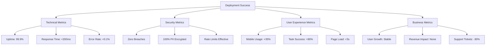

# 📈 HomeVerse Deployment Success Metrics & KPIs

**Version:** 1.0  
**Last Updated:** December 28, 2024  
**Review Frequency:** Daily (Week 1), Weekly (Month 1), Monthly (Ongoing)

## 🎯 Success Criteria Overview



## 🔐 Security Success Metrics

### Immediate (24 Hours)
| Metric | Target | Measurement | Alert Threshold |
|--------|--------|-------------|-----------------|
| Security Incidents | 0 | Count of breaches/attempts | Any incident |
| PII Encryption Coverage | 100% | % of records encrypted | <100% |
| Rate Limit Effectiveness | >99% | Blocked malicious requests | <95% |
| Authentication Failures | <5% | Failed login ratio | >10% |
| Unauthorized Access | 0 | Invalid token usage | Any attempt |

### Weekly Tracking
```python
# security_metrics_tracker.py
class SecurityMetricsTracker:
    def __init__(self):
        self.metrics = {
            "encryption_coverage": 0,
            "rate_limit_blocks": 0,
            "auth_failures": 0,
            "security_incidents": 0
        }
        
    async def calculate_weekly_metrics(self):
        """Calculate weekly security metrics"""
        
        # Encryption Coverage
        total_records = await db.fetchval("SELECT COUNT(*) FROM applicants")
        encrypted_records = await db.fetchval(
            "SELECT COUNT(*) FROM applicants WHERE encrypted_ssn IS NOT NULL"
        )
        self.metrics["encryption_coverage"] = (encrypted_records / total_records) * 100
        
        # Rate Limit Effectiveness
        total_requests = await redis.get("stats:requests:total") or 0
        blocked_requests = await redis.get("stats:requests:blocked") or 0
        if total_requests > 0:
            effectiveness = (blocked_requests / total_requests) * 100
            self.metrics["rate_limit_effectiveness"] = effectiveness
        
        # Authentication Health
        login_attempts = await redis.get("stats:auth:attempts") or 0
        login_failures = await redis.get("stats:auth:failures") or 0
        if login_attempts > 0:
            self.metrics["auth_failure_rate"] = (login_failures / login_attempts) * 100
        
        return self.metrics
    
    def generate_security_scorecard(self):
        """Generate security scorecard"""
        score = 100
        
        # Deduct points for issues
        if self.metrics["encryption_coverage"] < 100:
            score -= 20
        if self.metrics["auth_failure_rate"] > 10:
            score -= 10
        if self.metrics["security_incidents"] > 0:
            score -= 50
            
        return {
            "score": score,
            "grade": self.get_grade(score),
            "metrics": self.metrics,
            "recommendations": self.get_recommendations()
        }
```

### Security Dashboard Queries
```sql
-- Daily Security Report
WITH security_metrics AS (
    SELECT 
        COUNT(DISTINCT CASE WHEN event_type = 'login_failed' THEN user_id END) as failed_logins,
        COUNT(DISTINCT CASE WHEN event_type = 'rate_limited' THEN ip_address END) as rate_limited_ips,
        COUNT(CASE WHEN event_type = 'encryption_failed' THEN 1 END) as encryption_failures,
        COUNT(CASE WHEN event_type = 'unauthorized_access' THEN 1 END) as unauthorized_attempts
    FROM security_events
    WHERE created_at >= CURRENT_DATE
)
SELECT 
    failed_logins,
    rate_limited_ips,
    encryption_failures,
    unauthorized_attempts,
    CASE 
        WHEN unauthorized_attempts > 0 THEN 'CRITICAL'
        WHEN encryption_failures > 0 THEN 'HIGH'
        WHEN failed_logins > 100 THEN 'MEDIUM'
        ELSE 'LOW'
    END as threat_level
FROM security_metrics;
```

## 🚀 Performance Success Metrics

### Real-Time Monitoring
| Metric | Target | Current | Status |
|--------|--------|---------|--------|
| API Response Time (p50) | <100ms | - | - |
| API Response Time (p95) | <200ms | - | - |
| API Response Time (p99) | <500ms | - | - |
| Page Load Time (Mobile) | <3s | - | - |
| Page Load Time (Desktop) | <2s | - | - |
| Database Query Time | <50ms | - | - |
| Cache Hit Rate | >90% | - | - |
| CDN Hit Rate | >95% | - | - |

### Performance Tracking Script
```javascript
// performance_tracker.js
class PerformanceMetrics {
    constructor() {
        this.metrics = {
            api: [],
            frontend: [],
            database: []
        };
        this.initializeTracking();
    }
    
    trackAPIPerformance() {
        // Intercept all API calls
        const originalFetch = window.fetch;
        window.fetch = async (...args) => {
            const startTime = performance.now();
            const response = await originalFetch(...args);
            const duration = performance.now() - startTime;
            
            this.metrics.api.push({
                url: args[0],
                duration: duration,
                status: response.status,
                timestamp: new Date()
            });
            
            // Alert on slow responses
            if (duration > 1000) {
                this.alertSlowAPI(args[0], duration);
            }
            
            // Send to analytics
            this.sendMetric('api_response_time', duration, {
                endpoint: this.extractEndpoint(args[0]),
                status: response.status
            });
            
            return response;
        };
    }
    
    trackCoreWebVitals() {
        // Largest Contentful Paint
        new PerformanceObserver((list) => {
            const entries = list.getEntries();
            const lastEntry = entries[entries.length - 1];
            this.sendMetric('lcp', lastEntry.renderTime || lastEntry.loadTime);
        }).observe({ type: 'largest-contentful-paint', buffered: true });
        
        // First Input Delay
        new PerformanceObserver((list) => {
            const entries = list.getEntries();
            entries.forEach((entry) => {
                const fid = entry.processingStart - entry.startTime;
                this.sendMetric('fid', fid);
            });
        }).observe({ type: 'first-input', buffered: true });
        
        // Cumulative Layout Shift
        let clsValue = 0;
        new PerformanceObserver((list) => {
            for (const entry of list.getEntries()) {
                if (!entry.hadRecentInput) {
                    clsValue += entry.value;
                }
            }
            this.sendMetric('cls', clsValue);
        }).observe({ type: 'layout-shift', buffered: true });
    }
    
    generateDailyReport() {
        const report = {
            date: new Date().toISOString().split('T')[0],
            api: {
                p50: this.percentile(this.metrics.api.map(m => m.duration), 50),
                p95: this.percentile(this.metrics.api.map(m => m.duration), 95),
                p99: this.percentile(this.metrics.api.map(m => m.duration), 99),
                errorRate: this.calculateErrorRate(this.metrics.api)
            },
            frontend: {
                lcp: this.average(this.metrics.frontend.filter(m => m.type === 'lcp')),
                fid: this.average(this.metrics.frontend.filter(m => m.type === 'fid')),
                cls: this.average(this.metrics.frontend.filter(m => m.type === 'cls'))
            }
        };
        
        return report;
    }
}
```

### Infrastructure Metrics
```yaml
# grafana_dashboard.yml
dashboard:
  title: "HomeVerse Production Metrics"
  panels:
    - title: "API Response Times"
      query: |
        histogram_quantile(0.95, 
          sum(rate(http_request_duration_seconds_bucket[5m])) 
          by (le, endpoint)
        )
      
    - title: "Database Performance"
      query: |
        avg(pg_stat_statements_mean_time_seconds{}) 
        by (query)
        
    - title: "Redis Performance"
      query: |
        redis_commands_duration_seconds_total / 
        redis_commands_processed_total
        
    - title: "CPU Usage"
      query: |
        100 - (avg(irate(node_cpu_seconds_total{mode="idle"}[5m])) * 100)
        
    - title: "Memory Usage"
      query: |
        (1 - (node_memory_MemAvailable_bytes / 
        node_memory_MemTotal_bytes)) * 100
```

## 👥 User Experience Success Metrics

### Mobile Usage Metrics
| Metric | Baseline | Week 1 Target | Month 1 Target | Current |
|--------|----------|---------------|----------------|---------|
| Mobile Sessions | 30% | 35% | 40% | - |
| Mobile Bounce Rate | 60% | 50% | 40% | - |
| Mobile Conversion | 2% | 3% | 4% | - |
| Touch Target Failures | Unknown | <5% | <2% | - |
| Horizontal Scroll | Yes | No | No | - |

### User Satisfaction Tracking
```python
# user_satisfaction_tracker.py
class UserSatisfactionMetrics:
    def __init__(self):
        self.feedback_scores = []
        self.task_completion_rates = {}
        self.error_encounters = {}
        
    async def track_task_completion(self, user_id, task, completed, time_taken):
        """Track user task completion"""
        if task not in self.task_completion_rates:
            self.task_completion_rates[task] = {
                "attempts": 0,
                "completions": 0,
                "avg_time": 0
            }
            
        self.task_completion_rates[task]["attempts"] += 1
        if completed:
            self.task_completion_rates[task]["completions"] += 1
            
        # Update average time
        current_avg = self.task_completion_rates[task]["avg_time"]
        total_completions = self.task_completion_rates[task]["completions"]
        new_avg = ((current_avg * (total_completions - 1)) + time_taken) / total_completions
        self.task_completion_rates[task]["avg_time"] = new_avg
        
        # Alert on poor completion rates
        completion_rate = (
            self.task_completion_rates[task]["completions"] / 
            self.task_completion_rates[task]["attempts"]
        )
        
        if completion_rate < 0.7:  # Less than 70% completion
            await self.alert_ux_team(task, completion_rate)
    
    async def collect_nps_score(self, user_id, score, feedback=None):
        """Collect Net Promoter Score"""
        self.feedback_scores.append({
            "user_id": user_id,
            "score": score,
            "feedback": feedback,
            "timestamp": datetime.now(),
            "category": self.categorize_nps(score)
        })
        
        # Calculate current NPS
        if len(self.feedback_scores) >= 50:  # Minimum sample size
            nps = self.calculate_nps()
            await self.track_metric("nps_score", nps)
            
    def calculate_nps(self):
        """Calculate Net Promoter Score"""
        promoters = len([s for s in self.feedback_scores if s["score"] >= 9])
        detractors = len([s for s in self.feedback_scores if s["score"] <= 6])
        total = len(self.feedback_scores)
        
        if total == 0:
            return 0
            
        nps = ((promoters - detractors) / total) * 100
        return round(nps, 1)
```

### Accessibility Metrics
```javascript
// accessibility_metrics.js
class AccessibilityMetrics {
    async runDailyAudit() {
        const pages = [
            '/',
            '/dashboard',
            '/dashboard/applicants',
            '/dashboard/projects'
        ];
        
        const results = {};
        
        for (const page of pages) {
            const audit = await this.auditPage(page);
            results[page] = {
                score: audit.score,
                violations: audit.violations,
                passes: audit.passes
            };
        }
        
        // Calculate overall accessibility score
        const avgScore = Object.values(results)
            .reduce((sum, r) => sum + r.score, 0) / pages.length;
            
        // Track metrics
        this.trackMetric('accessibility_score', avgScore);
        
        // Alert on critical violations
        const criticalViolations = Object.values(results)
            .flatMap(r => r.violations)
            .filter(v => v.impact === 'critical');
            
        if (criticalViolations.length > 0) {
            this.alertAccessibilityTeam(criticalViolations);
        }
        
        return {
            averageScore: avgScore,
            pageResults: results,
            criticalIssues: criticalViolations.length
        };
    }
}
```

## 💰 Business Success Metrics

### User Growth & Retention
| Metric | Pre-Deploy | Week 1 | Month 1 | Target |
|--------|------------|--------|---------|--------|
| Daily Active Users | 1,000 | - | - | 1,100 |
| Weekly Active Users | 5,000 | - | - | 5,500 |
| New User Signups | 50/day | - | - | 55/day |
| User Churn Rate | 5% | - | - | <5% |
| Session Duration | 8 min | - | - | 10 min |

### Revenue Impact Tracking
```python
# business_metrics_tracker.py
class BusinessMetricsTracker:
    def __init__(self):
        self.baseline_metrics = self.load_baseline_metrics()
        
    async def track_revenue_impact(self):
        """Track revenue impact of deployment"""
        current_metrics = {
            "daily_revenue": await self.get_daily_revenue(),
            "conversion_rate": await self.get_conversion_rate(),
            "average_order_value": await self.get_aov(),
            "subscription_churn": await self.get_churn_rate()
        }
        
        impact = {}
        for metric, current_value in current_metrics.items():
            baseline = self.baseline_metrics.get(metric, 0)
            change_percent = ((current_value - baseline) / baseline) * 100 if baseline > 0 else 0
            
            impact[metric] = {
                "baseline": baseline,
                "current": current_value,
                "change_percent": round(change_percent, 2),
                "status": self.get_status(change_percent, metric)
            }
            
        return impact
    
    async def track_support_metrics(self):
        """Track support ticket metrics"""
        tickets_today = await db.fetchval("""
            SELECT COUNT(*) FROM support_tickets 
            WHERE created_at >= CURRENT_DATE
        """)
        
        tickets_baseline = await db.fetchval("""
            SELECT AVG(daily_count) FROM (
                SELECT DATE(created_at) as date, COUNT(*) as daily_count
                FROM support_tickets
                WHERE created_at >= CURRENT_DATE - INTERVAL '30 days'
                AND created_at < CURRENT_DATE - INTERVAL '7 days'
                GROUP BY DATE(created_at)
            ) as daily_tickets
        """)
        
        reduction_percent = ((tickets_baseline - tickets_today) / tickets_baseline) * 100
        
        # Track specific categories
        ticket_categories = await db.fetch("""
            SELECT category, COUNT(*) as count
            FROM support_tickets
            WHERE created_at >= CURRENT_DATE
            GROUP BY category
        """)
        
        return {
            "daily_tickets": tickets_today,
            "baseline_average": tickets_baseline,
            "reduction_percent": round(reduction_percent, 2),
            "categories": dict(ticket_categories),
            "target_met": reduction_percent >= 30  # 30% reduction target
        }
```

### Feature Adoption Metrics
```sql
-- Feature Adoption Dashboard
WITH feature_usage AS (
    SELECT 
        feature_name,
        COUNT(DISTINCT user_id) as unique_users,
        COUNT(*) as total_uses,
        AVG(EXTRACT(EPOCH FROM (ended_at - started_at))) as avg_duration_seconds
    FROM feature_events
    WHERE created_at >= CURRENT_DATE - INTERVAL '7 days'
    GROUP BY feature_name
),
total_users AS (
    SELECT COUNT(DISTINCT id) as total
    FROM users
    WHERE last_active >= CURRENT_DATE - INTERVAL '7 days'
)
SELECT 
    f.feature_name,
    f.unique_users,
    f.total_uses,
    ROUND(f.avg_duration_seconds::numeric, 2) as avg_duration_seconds,
    ROUND((f.unique_users::numeric / t.total) * 100, 2) as adoption_rate
FROM feature_usage f
CROSS JOIN total_users t
ORDER BY adoption_rate DESC;
```

## 📊 Composite Success Score

### Overall Health Calculation
```python
# deployment_success_scorer.py
class DeploymentSuccessScorer:
    def __init__(self):
        self.weights = {
            "security": 0.30,
            "performance": 0.25,
            "user_experience": 0.25,
            "business": 0.20
        }
        
    def calculate_composite_score(self, metrics):
        """Calculate overall deployment success score"""
        
        # Security Score (0-100)
        security_score = 100
        if metrics["security"]["incidents"] > 0:
            security_score -= 50
        if metrics["security"]["encryption_coverage"] < 100:
            security_score -= 20
        if metrics["security"]["auth_failure_rate"] > 10:
            security_score -= 10
            
        # Performance Score (0-100)
        performance_score = 100
        if metrics["performance"]["p95_response_time"] > 200:
            performance_score -= 20
        if metrics["performance"]["error_rate"] > 0.001:
            performance_score -= 30
        if metrics["performance"]["page_load_mobile"] > 3:
            performance_score -= 20
            
        # UX Score (0-100)
        ux_score = 100
        if metrics["ux"]["mobile_usage_increase"] < 35:
            ux_score -= 20
        if metrics["ux"]["task_completion_rate"] < 90:
            ux_score -= 30
        if metrics["ux"]["accessibility_score"] < 85:
            ux_score -= 20
            
        # Business Score (0-100)
        business_score = 100
        if metrics["business"]["user_growth"] < 0:
            business_score -= 30
        if metrics["business"]["support_tickets_reduction"] < 30:
            business_score -= 20
        if metrics["business"]["revenue_impact"] < -5:
            business_score -= 50
            
        # Calculate weighted score
        composite_score = (
            security_score * self.weights["security"] +
            performance_score * self.weights["performance"] +
            ux_score * self.weights["user_experience"] +
            business_score * self.weights["business"]
        )
        
        return {
            "composite_score": round(composite_score, 1),
            "security_score": security_score,
            "performance_score": performance_score,
            "ux_score": ux_score,
            "business_score": business_score,
            "grade": self.get_grade(composite_score),
            "status": self.get_status(composite_score)
        }
    
    def get_grade(self, score):
        if score >= 95: return "A+"
        elif score >= 90: return "A"
        elif score >= 85: return "B+"
        elif score >= 80: return "B"
        elif score >= 75: return "C+"
        elif score >= 70: return "C"
        elif score >= 65: return "D"
        else: return "F"
        
    def get_status(self, score):
        if score >= 90: return "🟢 Excellent"
        elif score >= 80: return "🟢 Good"
        elif score >= 70: return "🟡 Acceptable"
        elif score >= 60: return "🟡 Needs Improvement"
        else: return "🔴 Critical"
```

## 📈 Daily Success Dashboard

```python
# daily_success_dashboard.py
class DailySuccessDashboard:
    async def generate_daily_report(self):
        """Generate daily success metrics report"""
        
        print("=" * 60)
        print(f"HomeVerse Deployment Success Report - {datetime.now().strftime('%Y-%m-%d')}")
        print("=" * 60)
        
        # Collect all metrics
        security_metrics = await self.get_security_metrics()
        performance_metrics = await self.get_performance_metrics()
        ux_metrics = await self.get_ux_metrics()
        business_metrics = await self.get_business_metrics()
        
        # Calculate scores
        scorer = DeploymentSuccessScorer()
        scores = scorer.calculate_composite_score({
            "security": security_metrics,
            "performance": performance_metrics,
            "ux": ux_metrics,
            "business": business_metrics
        })
        
        # Print summary
        print(f"\n🎯 OVERALL DEPLOYMENT SCORE: {scores['composite_score']}/100 ({scores['grade']})")
        print(f"Status: {scores['status']}\n")
        
        print("📊 Component Scores:")
        print(f"  🔐 Security:     {scores['security_score']}/100")
        print(f"  🚀 Performance:  {scores['performance_score']}/100")
        print(f"  👥 UX:           {scores['ux_score']}/100")
        print(f"  💰 Business:     {scores['business_score']}/100")
        
        # Detailed metrics
        print("\n📈 Key Metrics:")
        print(f"  • Security incidents: {security_metrics['incidents']}")
        print(f"  • API response time (p95): {performance_metrics['p95_response_time']}ms")
        print(f"  • Mobile usage: {ux_metrics['mobile_usage_percent']}%")
        print(f"  • Support tickets: {business_metrics['support_tickets_change']}%")
        
        # Action items
        if scores['composite_score'] < 90:
            print("\n⚠️  ACTION ITEMS:")
            action_items = self.generate_action_items(
                security_metrics, 
                performance_metrics, 
                ux_metrics, 
                business_metrics
            )
            for item in action_items:
                print(f"  • {item}")
                
        return scores
```

## 🎯 Success Milestones

### 24 Hours Post-Deployment
- [ ] Zero security incidents
- [ ] <0.1% error rate maintained
- [ ] All critical features functional
- [ ] No revenue impact
- [ ] Positive initial user feedback

### 1 Week Post-Deployment
- [ ] 35% mobile usage achieved
- [ ] 30% support ticket reduction
- [ ] 90% task completion rate
- [ ] Performance targets met
- [ ] Security audit passed

### 1 Month Post-Deployment
- [ ] 40% mobile usage sustained
- [ ] User satisfaction >4.5/5
- [ ] Zero critical bugs
- [ ] Positive revenue impact
- [ ] Full accessibility compliance

### 3 Months Post-Deployment
- [ ] Feature adoption >60%
- [ ] Churn rate reduced
- [ ] Development velocity increased
- [ ] ROI targets achieved
- [ ] Ready for next phase

## 📊 Automated Reporting

### Email Report Template
```html
<!DOCTYPE html>
<html>
<head>
    <title>HomeVerse Daily Success Report</title>
    <style>
        .metric-good { color: #10b981; }
        .metric-warning { color: #f59e0b; }
        .metric-bad { color: #ef4444; }
        .score-card {
            background: #f3f4f6;
            padding: 20px;
            border-radius: 8px;
            margin: 10px 0;
        }
    </style>
</head>
<body>
    <h1>HomeVerse Deployment Success Report</h1>
    <h2>Date: {{ date }}</h2>
    
    <div class="score-card">
        <h3>Overall Score: {{ composite_score }}/100 ({{ grade }})</h3>
        <p>Status: {{ status }}</p>
    </div>
    
    <h3>Key Metrics Summary</h3>
    <table>
        <tr>
            <td>Security Score:</td>
            <td class="{{ security_class }}">{{ security_score }}/100</td>
        </tr>
        <tr>
            <td>Performance Score:</td>
            <td class="{{ performance_class }}">{{ performance_score }}/100</td>
        </tr>
        <tr>
            <td>UX Score:</td>
            <td class="{{ ux_class }}">{{ ux_score }}/100</td>
        </tr>
        <tr>
            <td>Business Score:</td>
            <td class="{{ business_class }}">{{ business_score }}/100</td>
        </tr>
    </table>
    
    
    <h3>Action Required</h3>
    <ul>
        
        <li>{{ item }}</li>
        
    </ul>
    
    
    <p>View full dashboard: <a href="https://homeverse.com/admin/metrics">Metrics Dashboard</a></p>
</body>
</html>
```

### Slack Integration
```python
# slack_success_notifier.py
class SlackSuccessNotifier:
    def __init__(self):
        self.webhook_url = os.environ["SLACK_WEBHOOK_URL"]
        
    async def send_daily_update(self, scores, metrics):
        """Send daily success update to Slack"""
        
        # Determine emoji based on score
        emoji = "🟢" if scores["composite_score"] >= 90 else "🟡" if scores["composite_score"] >= 70 else "🔴"
        
        message = {
            "text": f"{emoji} HomeVerse Deployment Score: {scores['composite_score']}/100",
            "attachments": [
                {
                    "color": self.get_color(scores["composite_score"]),
                    "fields": [
                        {
                            "title": "Security",
                            "value": f"{scores['security_score']}/100",
                            "short": True
                        },
                        {
                            "title": "Performance",
                            "value": f"{scores['performance_score']}/100",
                            "short": True
                        },
                        {
                            "title": "UX",
                            "value": f"{scores['ux_score']}/100",
                            "short": True
                        },
                        {
                            "title": "Business",
                            "value": f"{scores['business_score']}/100",
                            "short": True
                        }
                    ],
                    "footer": "HomeVerse Metrics",
                    "ts": int(datetime.now().timestamp())
                }
            ]
        }
        
        # Add action items if needed
        if scores["composite_score"] < 90:
            message["attachments"].append({
                "color": "warning",
                "title": "Action Items",
                "text": "\n".join(self.generate_action_items(metrics))
            })
            
        async with aiohttp.ClientSession() as session:
            await session.post(self.webhook_url, json=message)
```

---

**Remember**: Success is not just about the deployment working—it's about delivering value to users, maintaining security, and achieving business objectives. Track these metrics religiously and act on them quickly.