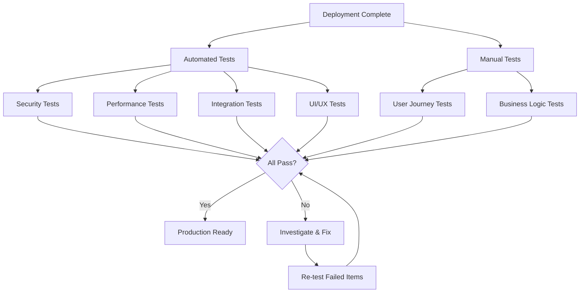

# ✅ HomeVerse Post-Deployment Validation Tests

**Version:** 1.0  
**Last Updated:** December 28, 2024  
**Execution Time:** 60-90 minutes  
**Automated Tests:** 85% | Manual Tests:** 15%

## 🎯 Validation Overview



## 🔐 Security Validation Tests

### 1. Rate Limiting Validation
```python
# test_rate_limiting.py
import asyncio
import aiohttp
from datetime import datetime

class RateLimitingTests:
    def __init__(self):
        self.base_url = "https://homeverse-api.onrender.com"
        self.results = []
        
    async def test_login_rate_limit(self):
        """Test login endpoint rate limiting"""
        print("🧪 Testing login rate limiting...")
        
        async with aiohttp.ClientSession() as session:
            # Test per-minute limit (5 attempts)
            attempts = []
            for i in range(7):
                start = datetime.now()
                async with session.post(
                    f"{self.base_url}/api/v1/auth/login",
                    json={"email": "test@test.com", "password": "wrong"},
                    headers={"X-Real-IP": "192.168.1.100"}
                ) as response:
                    attempts.append({
                        "attempt": i + 1,
                        "status": response.status,
                        "time": datetime.now() - start
                    })
                    
            # Verify rate limiting kicked in
            limited = [a for a in attempts if a["status"] == 429]
            
            self.results.append({
                "test": "Login Rate Limit",
                "passed": len(limited) >= 2,  # At least 2 should be limited
                "details": {
                    "total_attempts": 7,
                    "limited": len(limited),
                    "attempts": attempts
                }
            })
            
            return len(limited) >= 2
    
    async def test_api_rate_limit(self):
        """Test API endpoint rate limiting"""
        print("🧪 Testing API rate limiting...")
        
        # Get a valid token first
        token = await self.get_test_token()
        
        async with aiohttp.ClientSession() as session:
            # Make rapid requests
            responses = []
            for i in range(70):  # Exceed minute limit of 60
                async with session.get(
                    f"{self.base_url}/api/v1/applicants",
                    headers={"Authorization": f"Bearer {token}"}
                ) as response:
                    responses.append(response.status)
                    
                if i < 60:
                    await asyncio.sleep(0.5)  # Fast but not instant
            
            # Check if rate limited
            limited = responses.count(429)
            
            self.results.append({
                "test": "API Rate Limit",
                "passed": limited > 0,
                "details": {
                    "requests": len(responses),
                    "limited": limited,
                    "success": responses.count(200)
                }
            })
            
            return limited > 0
    
    async def test_rate_limit_headers(self):
        """Test rate limit headers are present"""
        print("🧪 Testing rate limit headers...")
        
        async with aiohttp.ClientSession() as session:
            async with session.get(
                f"{self.base_url}/api/v1/health"
            ) as response:
                headers = dict(response.headers)
                
                required_headers = [
                    "X-RateLimit-Limit",
                    "X-RateLimit-Remaining",
                    "X-RateLimit-Reset"
                ]
                
                present = [h for h in required_headers if h in headers]
                
                self.results.append({
                    "test": "Rate Limit Headers",
                    "passed": len(present) == len(required_headers),
                    "details": {
                        "required": required_headers,
                        "present": present,
                        "values": {h: headers.get(h) for h in present}
                    }
                })
                
                return len(present) == len(required_headers)
```

### 2. PII Encryption Validation
```python
# test_encryption.py
import psycopg2
from cryptography.fernet import Fernet

class EncryptionTests:
    def __init__(self):
        self.db_url = os.environ["DATABASE_URL"]
        self.results = []
        
    async def test_pii_encryption(self):
        """Verify all PII is encrypted in database"""
        print("🧪 Testing PII encryption...")
        
        conn = psycopg2.connect(self.db_url)
        cur = conn.cursor()
        
        # Check for unencrypted PII
        checks = {
            "ssn": "SELECT COUNT(*) FROM applicants WHERE ssn IS NOT NULL AND encrypted_ssn IS NULL",
            "email": "SELECT COUNT(*) FROM applicants WHERE email !~ '^[A-Za-z0-9+/=]+$'",  # Not base64
        }
        
        unencrypted = {}
        for field, query in checks.items():
            cur.execute(query)
            count = cur.fetchone()[0]
            unencrypted[field] = count
            
        all_encrypted = all(count == 0 for count in unencrypted.values())
        
        self.results.append({
            "test": "PII Encryption",
            "passed": all_encrypted,
            "details": {
                "unencrypted_records": unencrypted,
                "status": "All PII encrypted" if all_encrypted else "CRITICAL: Unencrypted PII found"
            }
        })
        
        cur.close()
        conn.close()
        
        return all_encrypted
    
    async def test_encryption_performance(self):
        """Test encryption/decryption performance"""
        print("🧪 Testing encryption performance...")
        
        # Create test data
        test_data = ["123-45-6789", "test@example.com", "555-0123"]
        
        # Time encryption
        start = datetime.now()
        encrypted = []
        for data in test_data * 100:  # 300 operations
            encrypted.append(encrypt(data))
        encryption_time = (datetime.now() - start).total_seconds()
        
        # Time decryption
        start = datetime.now()
        for enc in encrypted:
            decrypt(enc)
        decryption_time = (datetime.now() - start).total_seconds()
        
        # Check performance
        avg_encrypt = (encryption_time / 300) * 1000  # ms
        avg_decrypt = (decryption_time / 300) * 1000  # ms
        
        self.results.append({
            "test": "Encryption Performance",
            "passed": avg_encrypt < 10 and avg_decrypt < 10,  # <10ms each
            "details": {
                "avg_encryption_ms": round(avg_encrypt, 2),
                "avg_decryption_ms": round(avg_decrypt, 2),
                "total_operations": 600
            }
        })
        
        return avg_encrypt < 10 and avg_decrypt < 10
```

### 3. Authentication Security Tests
```python
# test_authentication.py
class AuthenticationTests:
    async def test_jwt_security(self):
        """Test JWT implementation security"""
        print("🧪 Testing JWT security...")
        
        tests_passed = 0
        total_tests = 5
        
        # Test 1: Expired token rejected
        expired_token = self.create_expired_token()
        response = await self.make_request_with_token(expired_token)
        if response.status == 401:
            tests_passed += 1
            
        # Test 2: Invalid signature rejected
        tampered_token = self.tamper_with_token(valid_token)
        response = await self.make_request_with_token(tampered_token)
        if response.status == 401:
            tests_passed += 1
            
        # Test 3: Token without required claims rejected
        incomplete_token = self.create_token_missing_claims()
        response = await self.make_request_with_token(incomplete_token)
        if response.status == 401:
            tests_passed += 1
            
        # Test 4: Token from different issuer rejected
        wrong_issuer_token = self.create_token_wrong_issuer()
        response = await self.make_request_with_token(wrong_issuer_token)
        if response.status == 401:
            tests_passed += 1
            
        # Test 5: Refresh token rotation working
        new_tokens = await self.test_refresh_rotation()
        if new_tokens["access"] != old_access and new_tokens["refresh"] != old_refresh:
            tests_passed += 1
            
        self.results.append({
            "test": "JWT Security",
            "passed": tests_passed == total_tests,
            "details": {
                "tests_passed": tests_passed,
                "total_tests": total_tests
            }
        })
        
        return tests_passed == total_tests
    
    async def test_password_security(self):
        """Test password handling security"""
        print("🧪 Testing password security...")
        
        # Test weak passwords rejected
        weak_passwords = ["123456", "password", "12345678", "qwerty"]
        rejected = 0
        
        for pwd in weak_passwords:
            response = await self.attempt_registration(
                email="test@test.com",
                password=pwd
            )
            if response.status == 400:
                rejected += 1
                
        self.results.append({
            "test": "Password Security",
            "passed": rejected == len(weak_passwords),
            "details": {
                "weak_passwords_tested": len(weak_passwords),
                "rejected": rejected
            }
        })
        
        return rejected == len(weak_passwords)
```

## 🚀 Performance Validation Tests

### 1. Response Time Tests
```python
# test_performance.py
class PerformanceTests:
    def __init__(self):
        self.results = []
        self.thresholds = {
            "api_response": 200,  # ms
            "page_load": 3000,    # ms
            "database_query": 100 # ms
        }
        
    async def test_api_response_times(self):
        """Test API endpoint response times"""
        print("🧪 Testing API response times...")
        
        endpoints = [
            "/api/v1/health",
            "/api/v1/applicants",
            "/api/v1/projects",
            "/api/v1/auth/verify"
        ]
        
        results = {}
        async with aiohttp.ClientSession() as session:
            for endpoint in endpoints:
                times = []
                for _ in range(10):  # 10 requests each
                    start = time.time()
                    async with session.get(
                        f"{self.base_url}{endpoint}",
                        headers=self.get_auth_headers()
                    ) as response:
                        duration = (time.time() - start) * 1000
                        times.append(duration)
                        
                avg_time = sum(times) / len(times)
                p95_time = sorted(times)[int(len(times) * 0.95)]
                
                results[endpoint] = {
                    "avg_ms": round(avg_time, 2),
                    "p95_ms": round(p95_time, 2),
                    "passed": p95_time < self.thresholds["api_response"]
                }
                
        all_passed = all(r["passed"] for r in results.values())
        
        self.results.append({
            "test": "API Response Times",
            "passed": all_passed,
            "details": results
        })
        
        return all_passed
    
    async def test_page_load_times(self):
        """Test frontend page load times"""
        print("🧪 Testing page load times...")
        
        from playwright.async_api import async_playwright
        
        pages = [
            "/",
            "/auth/login",
            "/dashboard",
            "/dashboard/applicants",
            "/dashboard/projects"
        ]
        
        results = {}
        async with async_playwright() as p:
            browser = await p.chromium.launch()
            
            for page_url in pages:
                page = await browser.new_page()
                
                # Measure load time
                start = time.time()
                await page.goto(f"https://homeverse.com{page_url}")
                await page.wait_for_load_state("networkidle")
                load_time = (time.time() - start) * 1000
                
                # Get performance metrics
                metrics = await page.evaluate("""
                    () => {
                        const perfData = performance.getEntriesByType('navigation')[0];
                        return {
                            domContentLoaded: perfData.domContentLoadedEventEnd - perfData.domContentLoadedEventStart,
                            loadComplete: perfData.loadEventEnd - perfData.loadEventStart
                        };
                    }
                """)
                
                results[page_url] = {
                    "total_ms": round(load_time, 2),
                    "dom_ms": round(metrics["domContentLoaded"], 2),
                    "passed": load_time < self.thresholds["page_load"]
                }
                
                await page.close()
                
            await browser.close()
            
        all_passed = all(r["passed"] for r in results.values())
        
        self.results.append({
            "test": "Page Load Times",
            "passed": all_passed,
            "details": results
        })
        
        return all_passed
    
    async def test_concurrent_users(self):
        """Test system under concurrent load"""
        print("🧪 Testing concurrent user load...")
        
        import aiohttp
        import asyncio
        
        async def make_request(session, endpoint):
            start = time.time()
            try:
                async with session.get(endpoint) as response:
                    return {
                        "status": response.status,
                        "time": time.time() - start,
                        "error": None
                    }
            except Exception as e:
                return {
                    "status": 0,
                    "time": time.time() - start,
                    "error": str(e)
                }
        
        # Simulate 50 concurrent users
        concurrent_users = 50
        requests_per_user = 5
        
        async with aiohttp.ClientSession() as session:
            tasks = []
            for _ in range(concurrent_users):
                for _ in range(requests_per_user):
                    endpoint = f"{self.base_url}/api/v1/health"
                    tasks.append(make_request(session, endpoint))
                    
            results = await asyncio.gather(*tasks)
            
        successful = [r for r in results if r["status"] == 200]
        avg_time = sum(r["time"] for r in successful) / len(successful)
        error_rate = (len(results) - len(successful)) / len(results)
        
        self.results.append({
            "test": "Concurrent Users",
            "passed": error_rate < 0.01 and avg_time < 1.0,
            "details": {
                "concurrent_users": concurrent_users,
                "total_requests": len(results),
                "successful": len(successful),
                "error_rate": round(error_rate * 100, 2),
                "avg_response_time": round(avg_time, 3)
            }
        })
        
        return error_rate < 0.01 and avg_time < 1.0
```

### 2. Database Performance Tests
```python
# test_database_performance.py
class DatabasePerformanceTests:
    async def test_query_performance(self):
        """Test critical query performance"""
        print("🧪 Testing database query performance...")
        
        queries = [
            {
                "name": "Get applicants with filters",
                "sql": """
                    SELECT * FROM applicants 
                    WHERE company_id = $1 
                    AND status = $2 
                    ORDER BY created_at DESC 
                    LIMIT 50
                """,
                "params": ["test-company", "pending"]
            },
            {
                "name": "Complex join for matching",
                "sql": """
                    SELECT a.*, p.* 
                    FROM applicants a
                    JOIN projects p ON ST_DWithin(a.location, p.location, 10000)
                    WHERE a.company_id = $1 
                    AND a.income <= p.max_income
                    LIMIT 20
                """,
                "params": ["test-company"]
            }
        ]
        
        results = {}
        for query in queries:
            times = []
            for _ in range(5):
                start = time.time()
                await db.fetch(query["sql"], *query["params"])
                duration = (time.time() - start) * 1000
                times.append(duration)
                
            avg_time = sum(times) / len(times)
            results[query["name"]] = {
                "avg_ms": round(avg_time, 2),
                "max_ms": round(max(times), 2),
                "passed": avg_time < 100  # 100ms threshold
            }
            
        self.results.append({
            "test": "Query Performance",
            "passed": all(r["passed"] for r in results.values()),
            "details": results
        })
```

## 🔄 Integration Tests

### 1. End-to-End User Flows
```python
# test_user_flows.py
class UserFlowTests:
    async def test_developer_workflow(self):
        """Test complete developer workflow"""
        print("🧪 Testing developer workflow...")
        
        steps = []
        
        # 1. Login as developer
        login_result = await self.login_as_developer()
        steps.append(("Login", login_result["success"]))
        
        # 2. Create a project
        project = await self.create_project({
            "name": "Test Housing Development",
            "units": 50,
            "location": {"lat": 37.7749, "lng": -122.4194}
        })
        steps.append(("Create Project", project["id"] is not None))
        
        # 3. View applicants
        applicants = await self.get_applicants()
        steps.append(("View Applicants", len(applicants) >= 0))
        
        # 4. Run matching
        matches = await self.run_matching(project["id"])
        steps.append(("Run Matching", matches["count"] >= 0))
        
        # 5. Approve application
        if matches["results"]:
            approval = await self.approve_application(
                matches["results"][0]["applicant_id"],
                project["id"]
            )
            steps.append(("Approve Application", approval["success"]))
        
        all_passed = all(success for _, success in steps)
        
        self.results.append({
            "test": "Developer Workflow",
            "passed": all_passed,
            "details": {"steps": steps}
        })
        
        return all_passed
    
    async def test_buyer_workflow(self):
        """Test complete buyer workflow"""
        print("🧪 Testing buyer workflow...")
        
        steps = []
        
        # 1. Register as buyer
        registration = await self.register_buyer({
            "email": f"buyer_{uuid.uuid4()}@test.com",
            "password": "Test123!@#",
            "full_name": "Test Buyer"
        })
        steps.append(("Registration", registration["success"]))
        
        # 2. Complete profile
        profile = await self.complete_buyer_profile({
            "income": 75000,
            "household_size": 3,
            "preferred_location": "San Francisco"
        })
        steps.append(("Complete Profile", profile["success"]))
        
        # 3. Search properties
        properties = await self.search_properties({
            "max_price": 500000,
            "min_bedrooms": 2,
            "location": "San Francisco"
        })
        steps.append(("Search Properties", len(properties) > 0))
        
        # 4. Submit application
        if properties:
            application = await self.submit_application(
                properties[0]["id"],
                {"message": "Interested in this property"}
            )
            steps.append(("Submit Application", application["success"]))
            
        # 5. Check status
        status = await self.check_application_status()
        steps.append(("Check Status", status["data"] is not None))
        
        all_passed = all(success for _, success in steps)
        
        self.results.append({
            "test": "Buyer Workflow",
            "passed": all_passed,
            "details": {"steps": steps}
        })
        
        return all_passed
```

### 2. API Integration Tests
```python
# test_api_integration.py
class APIIntegrationTests:
    async def test_auth_flow(self):
        """Test complete authentication flow"""
        print("🧪 Testing authentication flow...")
        
        # 1. Register new user
        register_data = {
            "email": f"test_{uuid.uuid4()}@test.com",
            "password": "SecurePass123!",
            "full_name": "Test User",
            "role": "developer"
        }
        
        register_response = await self.api_post("/api/v1/auth/register", register_data)
        assert register_response.status == 201
        
        # 2. Verify email (simulate)
        verify_response = await self.api_post("/api/v1/auth/verify", {
            "token": "simulated_verification_token"
        })
        assert verify_response.status == 200
        
        # 3. Login
        login_response = await self.api_post("/api/v1/auth/login", {
            "email": register_data["email"],
            "password": register_data["password"]
        })
        assert login_response.status == 200
        tokens = await login_response.json()
        
        # 4. Use access token
        profile_response = await self.api_get(
            "/api/v1/users/profile",
            headers={"Authorization": f"Bearer {tokens['access_token']}"}
        )
        assert profile_response.status == 200
        
        # 5. Refresh token
        refresh_response = await self.api_post("/api/v1/auth/refresh", {
            "refresh_token": tokens["refresh_token"]
        })
        assert refresh_response.status == 200
        
        # 6. Logout
        logout_response = await self.api_post(
            "/api/v1/auth/logout",
            headers={"Authorization": f"Bearer {tokens['access_token']}"}
        )
        assert logout_response.status == 200
        
        # 7. Verify token invalid after logout
        invalid_response = await self.api_get(
            "/api/v1/users/profile",
            headers={"Authorization": f"Bearer {tokens['access_token']}"}
        )
        assert invalid_response.status == 401
        
        self.results.append({
            "test": "Authentication Flow",
            "passed": True,
            "details": {"steps": 7, "all_passed": True}
        })
        
        return True
```

## 🎨 UI/UX Validation Tests

### 1. Mobile Responsiveness Tests
```python
# test_mobile_responsiveness.py
class MobileResponsivenessTests:
    async def test_mobile_layouts(self):
        """Test layouts on various mobile devices"""
        print("🧪 Testing mobile responsiveness...")
        
        devices = [
            {"name": "iPhone 12", "width": 390, "height": 844},
            {"name": "Galaxy S21", "width": 360, "height": 800},
            {"name": "iPad", "width": 768, "height": 1024}
        ]
        
        results = {}
        async with async_playwright() as p:
            browser = await p.chromium.launch()
            
            for device in devices:
                context = await browser.new_context(
                    viewport={"width": device["width"], "height": device["height"]},
                    user_agent="Mozilla/5.0 (iPhone; CPU iPhone OS 14_0 like Mac OS X)"
                )
                page = await context.new_page()
                
                # Test key pages
                issues = []
                for url in ["/", "/dashboard", "/dashboard/applicants"]:
                    await page.goto(f"https://homeverse.com{url}")
                    
                    # Check for horizontal scroll
                    has_horizontal_scroll = await page.evaluate("""
                        () => document.documentElement.scrollWidth > window.innerWidth
                    """)
                    
                    if has_horizontal_scroll:
                        issues.append(f"Horizontal scroll on {url}")
                    
                    # Check if mobile menu works
                    if url == "/dashboard":
                        menu_button = await page.query_selector(".mobile-menu-button")
                        if menu_button:
                            await menu_button.click()
                            menu_visible = await page.is_visible(".mobile-menu")
                            if not menu_visible:
                                issues.append("Mobile menu not working")
                    
                    # Check touch targets
                    small_buttons = await page.evaluate("""
                        () => {
                            const buttons = document.querySelectorAll('button, a');
                            const small = [];
                            buttons.forEach(btn => {
                                const rect = btn.getBoundingClientRect();
                                if (rect.width < 44 || rect.height < 44) {
                                    small.push(btn.textContent);
                                }
                            });
                            return small;
                        }
                    """)
                    
                    if small_buttons:
                        issues.append(f"Small touch targets: {small_buttons}")
                
                results[device["name"]] = {
                    "passed": len(issues) == 0,
                    "issues": issues
                }
                
                await context.close()
            
            await browser.close()
            
        all_passed = all(r["passed"] for r in results.values())
        
        self.results.append({
            "test": "Mobile Responsiveness",
            "passed": all_passed,
            "details": results
        })
        
        return all_passed
```

### 2. Accessibility Tests
```python
# test_accessibility.py
class AccessibilityTests:
    async def test_wcag_compliance(self):
        """Test WCAG 2.1 AA compliance"""
        print("🧪 Testing accessibility compliance...")
        
        from playwright.async_api import async_playwright
        
        results = {}
        async with async_playwright() as p:
            browser = await p.chromium.launch()
            page = await browser.new_page()
            
            # Inject axe-core
            await page.add_script_tag(
                url="https://cdnjs.cloudflare.com/ajax/libs/axe-core/4.7.0/axe.min.js"
            )
            
            pages_to_test = ["/", "/auth/login", "/dashboard"]
            
            for url in pages_to_test:
                await page.goto(f"https://homeverse.com{url}")
                
                # Run accessibility scan
                violations = await page.evaluate("""
                    async () => {
                        const results = await axe.run();
                        return results.violations;
                    }
                """)
                
                # Categorize by impact
                critical = [v for v in violations if v["impact"] == "critical"]
                serious = [v for v in violations if v["impact"] == "serious"]
                
                results[url] = {
                    "passed": len(critical) == 0 and len(serious) == 0,
                    "violations": {
                        "critical": len(critical),
                        "serious": len(serious),
                        "moderate": len([v for v in violations if v["impact"] == "moderate"]),
                        "minor": len([v for v in violations if v["impact"] == "minor"])
                    },
                    "details": [
                        {
                            "rule": v["id"],
                            "impact": v["impact"],
                            "description": v["description"],
                            "elements": len(v["nodes"])
                        }
                        for v in violations[:5]  # Top 5 issues
                    ]
                }
            
            await browser.close()
            
        all_passed = all(r["passed"] for r in results.values())
        
        self.results.append({
            "test": "WCAG Compliance",
            "passed": all_passed,
            "details": results
        })
        
        return all_passed
    
    async def test_keyboard_navigation(self):
        """Test keyboard navigation functionality"""
        print("🧪 Testing keyboard navigation...")
        
        async with async_playwright() as p:
            browser = await p.chromium.launch()
            page = await browser.new_page()
            
            await page.goto("https://homeverse.com/dashboard")
            
            # Test tab navigation
            elements_focused = []
            for i in range(20):  # Tab through 20 elements
                await page.keyboard.press("Tab")
                focused = await page.evaluate("""
                    () => {
                        const el = document.activeElement;
                        return {
                            tag: el.tagName,
                            text: el.textContent?.slice(0, 30),
                            visible: el.offsetParent !== null
                        };
                    }
                """)
                elements_focused.append(focused)
            
            # Check for skip links
            await page.keyboard.press("Tab")
            skip_link = await page.evaluate("""
                () => {
                    const el = document.activeElement;
                    return el.textContent?.includes('Skip to');
                }
            """)
            
            # Test escape key on modal
            await page.click("button:has-text('Add')")  # Open a modal
            await page.keyboard.press("Escape")
            modal_closed = await page.is_hidden(".modal")
            
            await browser.close()
            
        self.results.append({
            "test": "Keyboard Navigation",
            "passed": skip_link and modal_closed,
            "details": {
                "skip_links": skip_link,
                "escape_closes_modal": modal_closed,
                "focusable_elements": len([e for e in elements_focused if e["visible"]])
            }
        })
        
        return skip_link and modal_closed
```

## 📊 Business Logic Tests

### 1. Critical Business Rules
```python
# test_business_logic.py
class BusinessLogicTests:
    async def test_ami_calculations(self):
        """Test Area Median Income calculations"""
        print("🧪 Testing AMI calculations...")
        
        test_cases = [
            {
                "income": 50000,
                "household_size": 1,
                "area": "San Francisco",
                "expected_ami_percent": 45  # Approximate
            },
            {
                "income": 75000,
                "household_size": 3,
                "area": "San Francisco",
                "expected_ami_percent": 65  # Approximate
            }
        ]
        
        results = []
        for case in test_cases:
            ami_percent = await self.calculate_ami(
                case["income"],
                case["household_size"],
                case["area"]
            )
            
            # Allow 5% variance
            passed = abs(ami_percent - case["expected_ami_percent"]) <= 5
            results.append({
                "case": case,
                "calculated": ami_percent,
                "passed": passed
            })
            
        all_passed = all(r["passed"] for r in results)
        
        self.results.append({
            "test": "AMI Calculations",
            "passed": all_passed,
            "details": results
        })
        
        return all_passed
    
    async def test_matching_algorithm(self):
        """Test applicant-project matching logic"""
        print("🧪 Testing matching algorithm...")
        
        # Create test data
        applicant = {
            "income": 60000,
            "household_size": 2,
            "location": {"lat": 37.7749, "lng": -122.4194},
            "max_rent": 2000
        }
        
        projects = [
            {
                "id": "1",
                "max_income": 70000,
                "min_household": 1,
                "location": {"lat": 37.7849, "lng": -122.4094},
                "rent": 1800
            },
            {
                "id": "2",
                "max_income": 50000,  # Applicant exceeds
                "min_household": 1,
                "location": {"lat": 37.7749, "lng": -122.4194},
                "rent": 1500
            }
        ]
        
        matches = await self.run_matching_algorithm(applicant, projects)
        
        # Should match project 1, not project 2
        matched_ids = [m["project_id"] for m in matches]
        
        self.results.append({
            "test": "Matching Algorithm",
            "passed": "1" in matched_ids and "2" not in matched_ids,
            "details": {
                "applicant": applicant,
                "matched_projects": matched_ids,
                "match_count": len(matches)
            }
        })
        
        return "1" in matched_ids and "2" not in matched_ids
```

## 🎯 Manual Testing Checklist

### Visual Inspection
- [ ] Logo displays correctly on all pages
- [ ] Colors match brand guidelines (teal primary)
- [ ] Fonts render correctly
- [ ] Images load and display properly
- [ ] Icons are visible and aligned
- [ ] No overlapping elements
- [ ] Consistent spacing throughout

### User Experience
- [ ] Forms show inline validation
- [ ] Error messages are helpful
- [ ] Success messages appear
- [ ] Loading states display
- [ ] Empty states have CTAs
- [ ] Tooltips provide guidance
- [ ] Navigation is intuitive

### Cross-Browser Testing
- [ ] Chrome (latest)
- [ ] Firefox (latest)
- [ ] Safari (latest)
- [ ] Edge (latest)
- [ ] Mobile Safari (iOS)
- [ ] Chrome Mobile (Android)

### Edge Cases
- [ ] Very long names display correctly
- [ ] Large numbers format properly
- [ ] Special characters handled
- [ ] Empty data shows appropriate messages
- [ ] Network errors handled gracefully
- [ ] Session timeout works correctly

## 📊 Test Execution Report

```python
# generate_test_report.py
class TestReportGenerator:
    def __init__(self, test_results):
        self.results = test_results
        self.timestamp = datetime.now()
        
    def generate_html_report(self):
        """Generate HTML test report"""
        
        total_tests = len(self.results)
        passed_tests = sum(1 for r in self.results if r["passed"])
        failed_tests = total_tests - passed_tests
        pass_rate = (passed_tests / total_tests) * 100
        
        html = f"""
        <!DOCTYPE html>
        <html>
        <head>
            <title>HomeVerse Post-Deployment Test Report</title>
            <style>
                body {{ font-family: Arial, sans-serif; margin: 40px; }}
                .header {{ background: #14b8a6; color: white; padding: 20px; border-radius: 8px; }}
                .summary {{ display: flex; gap: 20px; margin: 20px 0; }}
                .metric {{ background: #f5f5f5; padding: 20px; border-radius: 8px; flex: 1; }}
                .passed {{ color: #10b981; }}
                .failed {{ color: #ef4444; }}
                .test-result {{ margin: 20px 0; padding: 20px; border: 1px solid #ddd; border-radius: 8px; }}
                .test-passed {{ border-color: #10b981; background: #f0fdf4; }}
                .test-failed {{ border-color: #ef4444; background: #fef2f2; }}
                pre {{ background: #f5f5f5; padding: 10px; border-radius: 4px; overflow-x: auto; }}
            </style>
        </head>
        <body>
            <div class="header">
                <h1>HomeVerse Post-Deployment Test Report</h1>
                <p>Generated: {self.timestamp.strftime('%Y-%m-%d %H:%M:%S')}</p>
            </div>
            
            <div class="summary">
                <div class="metric">
                    <h3>Total Tests</h3>
                    <p style="font-size: 32px; margin: 0;">{total_tests}</p>
                </div>
                <div class="metric">
                    <h3>Passed</h3>
                    <p style="font-size: 32px; margin: 0;" class="passed">{passed_tests}</p>
                </div>
                <div class="metric">
                    <h3>Failed</h3>
                    <p style="font-size: 32px; margin: 0;" class="failed">{failed_tests}</p>
                </div>
                <div class="metric">
                    <h3>Pass Rate</h3>
                    <p style="font-size: 32px; margin: 0;">{pass_rate:.1f}%</p>
                </div>
            </div>
            
            <h2>Test Results</h2>
        """
        
        for result in self.results:
            status = "passed" if result["passed"] else "failed"
            icon = "✅" if result["passed"] else "❌"
            
            html += f"""
            <div class="test-result test-{status}">
                <h3>{icon} {result['test']}</h3>
                <pre>{json.dumps(result['details'], indent=2)}</pre>
            </div>
            """
            
        html += """
        </body>
        </html>
        """
        
        return html
    
    def save_report(self, filename="test_report.html"):
        """Save test report to file"""
        with open(filename, "w") as f:
            f.write(self.generate_html_report())
        print(f"📊 Test report saved to {filename}")
```

## 🚀 Running the Tests

```python
# run_all_tests.py
import asyncio
from datetime import datetime

async def run_post_deployment_tests():
    """Run all post-deployment validation tests"""
    
    print("🚀 Starting post-deployment validation...")
    print("=" * 50)
    
    start_time = datetime.now()
    all_results = []
    
    # Security Tests
    security_tests = RateLimitingTests()
    await security_tests.test_login_rate_limit()
    await security_tests.test_api_rate_limit()
    await security_tests.test_rate_limit_headers()
    all_results.extend(security_tests.results)
    
    encryption_tests = EncryptionTests()
    await encryption_tests.test_pii_encryption()
    await encryption_tests.test_encryption_performance()
    all_results.extend(encryption_tests.results)
    
    auth_tests = AuthenticationTests()
    await auth_tests.test_jwt_security()
    await auth_tests.test_password_security()
    all_results.extend(auth_tests.results)
    
    # Performance Tests
    perf_tests = PerformanceTests()
    await perf_tests.test_api_response_times()
    await perf_tests.test_page_load_times()
    await perf_tests.test_concurrent_users()
    all_results.extend(perf_tests.results)
    
    # Integration Tests
    flow_tests = UserFlowTests()
    await flow_tests.test_developer_workflow()
    await flow_tests.test_buyer_workflow()
    all_results.extend(flow_tests.results)
    
    # UI/UX Tests
    mobile_tests = MobileResponsivenessTests()
    await mobile_tests.test_mobile_layouts()
    all_results.extend(mobile_tests.results)
    
    a11y_tests = AccessibilityTests()
    await a11y_tests.test_wcag_compliance()
    await a11y_tests.test_keyboard_navigation()
    all_results.extend(a11y_tests.results)
    
    # Business Logic Tests
    logic_tests = BusinessLogicTests()
    await logic_tests.test_ami_calculations()
    await logic_tests.test_matching_algorithm()
    all_results.extend(logic_tests.results)
    
    # Generate report
    duration = (datetime.now() - start_time).total_seconds()
    
    print("\n" + "=" * 50)
    print(f"✅ Testing completed in {duration:.1f} seconds")
    print(f"Total tests: {len(all_results)}")
    print(f"Passed: {sum(1 for r in all_results if r['passed'])}")
    print(f"Failed: {sum(1 for r in all_results if not r['passed'])}")
    
    # Save report
    report_gen = TestReportGenerator(all_results)
    report_gen.save_report(f"test_report_{datetime.now().strftime('%Y%m%d_%H%M%S')}.html")
    
    # Return overall pass/fail
    return all(r["passed"] for r in all_results)

if __name__ == "__main__":
    success = asyncio.run(run_post_deployment_tests())
    exit(0 if success else 1)
```

---

**Remember**: Thorough validation is the difference between a successful deployment and a production incident. Take the time to run all tests and investigate any failures before declaring victory.