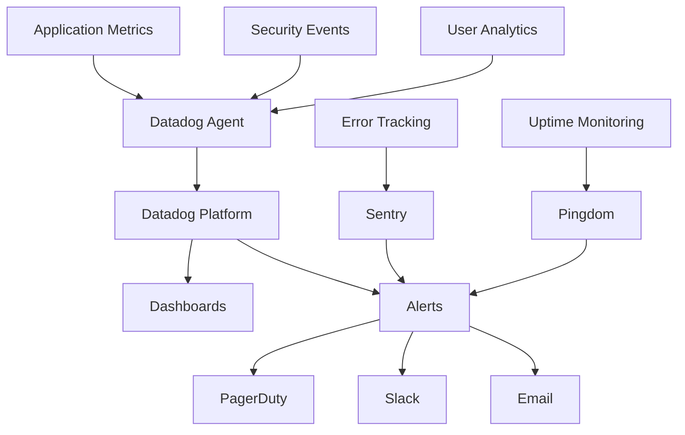

# 📊 HomeVerse Production Monitoring & Alerting Guide

**Version:** 1.0  
**Last Updated:** December 28, 2024  
**Purpose:** Comprehensive monitoring setup for security, performance, and UX

## 🎯 Monitoring Architecture



## 🔐 Security Monitoring

### 1. Rate Limiting Metrics
```python
# rate_limit_monitor.py
from datadog import initialize, statsd
import time
from datetime import datetime, timedelta

class RateLimitMonitor:
    def __init__(self):
        initialize(api_key=DATADOG_API_KEY, app_key=DATADOG_APP_KEY)
        
    def track_rate_limit_hit(self, endpoint: str, user_id: str, ip: str):
        """Track when rate limits are hit"""
        # Increment counter
        statsd.increment('security.rate_limit.hit', tags=[
            f'endpoint:{endpoint}',
            f'user:{user_id}',
            f'ip:{ip}'
        ])
        
        # Track patterns
        if self.is_suspicious_pattern(ip):
            statsd.event(
                title='Suspicious Rate Limit Pattern Detected',
                text=f'IP {ip} hitting multiple endpoints rapidly',
                alert_type='warning',
                tags=['security', 'rate_limit', 'suspicious']
            )
    
    def monitor_effectiveness(self):
        """Monitor if rate limits are working effectively"""
        metrics = {
            'total_requests': statsd.get('api.requests.total'),
            'rate_limited': statsd.get('security.rate_limit.hit'),
            'effectiveness': 0
        }
        
        if metrics['total_requests'] > 0:
            metrics['effectiveness'] = (
                metrics['rate_limited'] / metrics['total_requests']
            ) * 100
            
        # Alert if rate limiting seems ineffective
        if metrics['effectiveness'] < 0.1:  # Less than 0.1% limited
            statsd.event(
                title='Rate Limiting May Be Too Permissive',
                text='Consider tightening rate limits',
                alert_type='info'
            )
            
        return metrics
```

### 2. PII Encryption Monitoring
```python
# encryption_monitor.py
class EncryptionMonitor:
    def __init__(self):
        self.logger = logging.getLogger('encryption_monitor')
        
    async def verify_encryption_health(self):
        """Continuous monitoring of PII encryption"""
        checks = {
            'encryption_active': True,
            'unencrypted_records': 0,
            'encryption_failures': 0,
            'decryption_failures': 0
        }
        
        # Sample random records
        sample_size = 100
        records = await db.execute(
            "SELECT * FROM applicants ORDER BY RANDOM() LIMIT %s",
            sample_size
        )
        
        for record in records:
            # Check if PII fields are encrypted
            if record.ssn and not self.is_encrypted(record.ssn):
                checks['unencrypted_records'] += 1
                statsd.increment('security.pii.unencrypted')
                
                # Critical alert
                await self.alert_security_team(
                    severity='critical',
                    message=f'Unencrypted SSN found: record {record.id}'
                )
        
        # Track metrics
        statsd.gauge('security.encryption.health_score', 
                    100 - checks['unencrypted_records'])
        
        return checks
    
    def track_encryption_performance(self, operation: str, duration: float):
        """Monitor encryption/decryption performance"""
        statsd.histogram(f'security.encryption.{operation}.duration', 
                        duration, tags=[f'operation:{operation}'])
        
        # Alert if encryption is too slow
        if duration > 0.1:  # 100ms threshold
            statsd.event(
                title=f'Slow Encryption Operation',
                text=f'{operation} took {duration:.2f}s',
                alert_type='warning'
            )
```

### 3. Authentication Monitoring
```python
# auth_monitor.py
class AuthenticationMonitor:
    def __init__(self):
        self.failed_attempts = defaultdict(list)
        
    async def track_login_attempt(self, email: str, ip: str, success: bool):
        """Monitor authentication attempts"""
        tags = [
            f'email:{email}',
            f'ip:{ip}',
            f'success:{success}'
        ]
        
        # Track metrics
        statsd.increment('auth.login.attempt', tags=tags)
        
        if not success:
            self.failed_attempts[ip].append(datetime.now())
            
            # Check for brute force
            recent_failures = [
                t for t in self.failed_attempts[ip] 
                if t > datetime.now() - timedelta(minutes=5)
            ]
            
            if len(recent_failures) >= 5:
                await self.trigger_brute_force_alert(ip, email)
                
    async def monitor_jwt_usage(self):
        """Monitor JWT token health"""
        metrics = {
            'tokens_issued': await redis.get('jwt:issued:count'),
            'tokens_revoked': await redis.get('jwt:revoked:count'),
            'active_sessions': await redis.scard('jwt:active'),
            'expired_not_cleaned': await self.count_expired_tokens()
        }
        
        # Track metrics
        for metric, value in metrics.items():
            statsd.gauge(f'auth.jwt.{metric}', value)
            
        # Alert on anomalies
        if metrics['expired_not_cleaned'] > 1000:
            statsd.event(
                title='JWT Cleanup Required',
                text='Too many expired tokens in system',
                alert_type='warning'
            )
```

## 📈 Performance Monitoring

### 1. API Response Time Tracking
```python
# performance_monitor.py
from functools import wraps
import time

def monitor_endpoint(endpoint_name: str):
    """Decorator to monitor endpoint performance"""
    def decorator(func):
        @wraps(func)
        async def wrapper(*args, **kwargs):
            start_time = time.time()
            
            try:
                result = await func(*args, **kwargs)
                status = 'success'
                status_code = getattr(result, 'status_code', 200)
            except Exception as e:
                status = 'error'
                status_code = 500
                raise
            finally:
                duration = time.time() - start_time
                
                # Track metrics
                statsd.histogram(
                    'api.response_time',
                    duration,
                    tags=[
                        f'endpoint:{endpoint_name}',
                        f'status:{status}',
                        f'status_code:{status_code}'
                    ]
                )
                
                # Alert on slow responses
                if duration > 3.0:
                    statsd.event(
                        title=f'Slow API Response',
                        text=f'{endpoint_name} took {duration:.2f}s',
                        alert_type='warning',
                        tags=['performance', 'api', 'slow']
                    )
                    
            return result
        return wrapper
    return decorator

# Usage example
@app.post("/api/v1/applicants")
@monitor_endpoint("create_applicant")
async def create_applicant(data: ApplicantCreate):
    # Implementation
    pass
```

### 2. Database Performance Monitoring
```python
# db_monitor.py
class DatabaseMonitor:
    def __init__(self):
        self.slow_query_threshold = 1.0  # 1 second
        
    async def monitor_query_performance(self):
        """Monitor database query performance"""
        # Get slow queries from Supabase
        slow_queries = await db.execute("""
            SELECT query, calls, mean_exec_time, stddev_exec_time
            FROM pg_stat_statements
            WHERE mean_exec_time > %s
            ORDER BY mean_exec_time DESC
            LIMIT 10
        """, self.slow_query_threshold * 1000)
        
        for query in slow_queries:
            statsd.gauge(
                'db.slow_query.mean_time',
                query['mean_exec_time'],
                tags=[f'query_hash:{hash(query["query"][:50])}']
            )
            
            # Alert on consistently slow queries
            if query['calls'] > 100 and query['mean_exec_time'] > 2000:
                await self.alert_slow_query(query)
    
    async def monitor_connection_pool(self):
        """Monitor database connection pool health"""
        pool_stats = await db.pool.get_stats()
        
        metrics = {
            'connections.active': pool_stats['active'],
            'connections.idle': pool_stats['idle'],
            'connections.total': pool_stats['total'],
            'connections.waiting': pool_stats['waiting']
        }
        
        for metric, value in metrics.items():
            statsd.gauge(f'db.pool.{metric}', value)
            
        # Alert if pool is exhausted
        if pool_stats['waiting'] > 0:
            statsd.event(
                title='Database Connection Pool Exhausted',
                text=f'{pool_stats["waiting"]} requests waiting for connection',
                alert_type='error'
            )
```

### 3. Frontend Performance Monitoring
```javascript
// performance_tracker.js
class PerformanceTracker {
    constructor() {
        this.datadog = new DatadogRum();
        this.initializeTracking();
    }
    
    initializeTracking() {
        // Core Web Vitals
        new PerformanceObserver((list) => {
            for (const entry of list.getEntries()) {
                // Track Largest Contentful Paint
                if (entry.entryType === 'largest-contentful-paint') {
                    this.datadog.addTiming('lcp', entry.startTime);
                }
                
                // Track First Input Delay
                if (entry.entryType === 'first-input') {
                    const fid = entry.processingStart - entry.startTime;
                    this.datadog.addTiming('fid', fid);
                }
                
                // Track Cumulative Layout Shift
                if (entry.entryType === 'layout-shift' && !entry.hadRecentInput) {
                    this.datadog.addTiming('cls', entry.value);
                }
            }
        }).observe({ entryTypes: ['largest-contentful-paint', 'first-input', 'layout-shift'] });
        
        // Track Time to Interactive
        if ('PerformanceLongTaskTiming' in window) {
            const observer = new PerformanceObserver((list) => {
                const perfEntries = list.getEntries();
                for (const entry of perfEntries) {
                    this.datadog.addTiming('long_task', entry.duration);
                }
            });
            observer.observe({ entryTypes: ['longtask'] });
        }
    }
    
    trackMobilePerformance() {
        // Mobile-specific metrics
        const metrics = {
            viewport_width: window.innerWidth,
            device_memory: navigator.deviceMemory || 'unknown',
            connection_type: navigator.connection?.effectiveType || 'unknown',
            save_data: navigator.connection?.saveData || false
        };
        
        this.datadog.addContext('mobile_metrics', metrics);
        
        // Track mobile-specific issues
        if (window.innerWidth < 768) {
            // Monitor horizontal scroll
            if (document.documentElement.scrollWidth > window.innerWidth) {
                this.datadog.addError('Mobile horizontal scroll detected');
            }
            
            // Monitor touch responsiveness
            let touchStart = 0;
            document.addEventListener('touchstart', () => {
                touchStart = performance.now();
            });
            
            document.addEventListener('touchend', () => {
                const touchDuration = performance.now() - touchStart;
                if (touchDuration > 300) {
                    this.datadog.addTiming('slow_touch_response', touchDuration);
                }
            });
        }
    }
}
```

## 👥 User Experience Monitoring

### 1. User Journey Tracking
```javascript
// ux_analytics.js
class UXAnalytics {
    constructor() {
        this.mixpanel = window.mixpanel;
        this.journeyStart = Date.now();
        this.interactions = [];
    }
    
    trackUserJourney(userId, role) {
        // Track key user journeys
        const journeys = {
            developer: [
                'view_dashboard',
                'create_project',
                'review_applicants',
                'approve_application'
            ],
            buyer: [
                'search_properties',
                'view_property',
                'submit_application',
                'check_status'
            ],
            lender: [
                'view_opportunities',
                'analyze_investment',
                'make_investment',
                'view_returns'
            ]
        };
        
        // Set up funnel tracking
        if (journeys[role]) {
            this.mixpanel.track_funnel(
                `${role}_journey`,
                journeys[role]
            );
        }
    }
    
    trackFormAbandonment(formName, field, timeSpent) {
        this.mixpanel.track('form_abandoned', {
            form_name: formName,
            last_field: field,
            time_spent: timeSpent,
            completed_fields: this.getCompletedFields(formName),
            device_type: this.getDeviceType()
        });
        
        // Alert if high abandonment rate
        this.checkAbandonmentRate(formName);
    }
    
    trackErrorRecovery(error, userAction, recovered) {
        const errorData = {
            error_type: error.type,
            error_message: error.message,
            user_action: userAction,
            recovered: recovered,
            recovery_time: recovered ? Date.now() - error.timestamp : null
        };
        
        this.mixpanel.track('error_recovery', errorData);
        
        // Track unrecoverable errors
        if (!recovered) {
            window.datadog.addError(error, {
                context: errorData
            });
        }
    }
}
```

### 2. Accessibility Monitoring
```javascript
// accessibility_monitor.js
class AccessibilityMonitor {
    constructor() {
        this.violations = [];
        this.initializeMonitoring();
    }
    
    async runAccessibilityAudit() {
        if (typeof window.axe === 'undefined') {
            await this.loadAxe();
        }
        
        const results = await window.axe.run();
        
        // Track violations
        results.violations.forEach(violation => {
            this.datadog.addError('Accessibility violation', {
                rule: violation.id,
                impact: violation.impact,
                elements: violation.nodes.length,
                help: violation.help
            });
            
            // Critical violations need immediate attention
            if (violation.impact === 'critical') {
                this.alertAccessibilityTeam(violation);
            }
        });
        
        // Track accessibility score
        const score = this.calculateA11yScore(results);
        this.datadog.gauge('ux.accessibility.score', score);
        
        return results;
    }
    
    monitorKeyboardNavigation() {
        let keyboardUser = false;
        let lastMouseMove = Date.now();
        
        // Detect keyboard users
        document.addEventListener('keydown', (e) => {
            if (e.key === 'Tab') {
                keyboardUser = true;
                this.datadog.increment('ux.keyboard_navigation.usage');
            }
        });
        
        // Track focus trap issues
        let focusHistory = [];
        document.addEventListener('focusin', (e) => {
            focusHistory.push(e.target);
            
            if (focusHistory.length > 10) {
                focusHistory = focusHistory.slice(-10);
            }
            
            // Detect focus trap
            if (this.isFocusTrapped(focusHistory)) {
                this.datadog.addError('Focus trap detected', {
                    elements: focusHistory.map(el => el.tagName)
                });
            }
        });
    }
}
```

### 3. Mobile UX Monitoring
```javascript
// mobile_ux_monitor.js
class MobileUXMonitor {
    constructor() {
        this.touchEvents = [];
        this.scrollEvents = [];
        this.initializeMobileTracking();
    }
    
    trackMobileUsability() {
        // Track viewport issues
        if (window.innerWidth < 768) {
            // Check for horizontal scroll
            const hasHorizontalScroll = 
                document.documentElement.scrollWidth > window.innerWidth;
            
            if (hasHorizontalScroll) {
                this.datadog.addError('Mobile horizontal scroll detected');
            }
            
            // Track zoom events (indicating text too small)
            let lastScale = 1;
            window.visualViewport?.addEventListener('resize', () => {
                const currentScale = window.visualViewport.scale;
                if (currentScale !== lastScale) {
                    this.datadog.increment('ux.mobile.zoom_events');
                    lastScale = currentScale;
                }
            });
            
            // Monitor touch target sizes
            document.querySelectorAll('button, a, input').forEach(element => {
                const rect = element.getBoundingClientRect();
                if (rect.width < 44 || rect.height < 44) {
                    this.datadog.addError('Touch target too small', {
                        element: element.tagName,
                        size: `${rect.width}x${rect.height}`,
                        minimum: '44x44'
                    });
                }
            });
        }
    }
    
    trackMobilePerformanceIssues() {
        // Monitor janky scrolling
        let lastScrollTime = 0;
        let scrollSamples = [];
        
        window.addEventListener('scroll', () => {
            const now = performance.now();
            const delta = now - lastScrollTime;
            
            if (lastScrollTime > 0) {
                scrollSamples.push(delta);
                
                if (scrollSamples.length > 10) {
                    const avgDelta = scrollSamples.reduce((a, b) => a + b) / scrollSamples.length;
                    
                    if (avgDelta > 50) { // More than 50ms between frames
                        this.datadog.increment('ux.mobile.janky_scroll');
                    }
                    
                    scrollSamples = [];
                }
            }
            
            lastScrollTime = now;
        });
    }
}
```

## 🚨 Alert Configuration

### Critical Alerts (Page immediately)
```yaml
# critical_alerts.yml
alerts:
  - name: unencrypted_pii_detected
    query: "sum:security.pii.unencrypted{*} > 0"
    message: |
      CRITICAL: Unencrypted PII detected in production!
      {{#is_alert}}
      Immediate action required - check encryption service
      {{/is_alert}}
    escalation_message: "CTO notified - unencrypted PII in production"
    priority: P1
    
  - name: authentication_bypass_attempt
    query: "sum:auth.bypass.attempt{*} > 0"
    message: |
      SECURITY: Authentication bypass attempt detected
      IP: {{ip.name}}
      User: {{user.name}}
    priority: P1
    
  - name: rate_limiting_disabled
    query: "avg:security.rate_limit.active{*} < 1"
    message: "CRITICAL: Rate limiting is not active!"
    priority: P1
```

### High Priority Alerts (Wake up on-call)
```yaml
# high_priority_alerts.yml
alerts:
  - name: high_error_rate
    query: "avg:api.error_rate{*} > 0.05"
    message: |
      High error rate detected: {{value}}%
      Check application logs for details
    priority: P2
    
  - name: database_connection_exhausted
    query: "max:db.pool.connections.waiting{*} > 5"
    message: "Database connection pool exhausted - scaling needed"
    priority: P2
    
  - name: slow_api_response
    query: "avg:api.response_time{*} > 3"
    message: "API response time exceeding 3 seconds"
    priority: P2
```

### Warning Alerts (Business hours)
```yaml
# warning_alerts.yml
alerts:
  - name: mobile_performance_degraded
    query: "avg:ux.mobile.lcp{*} > 4"
    message: "Mobile load times exceeding 4 seconds"
    priority: P3
    
  - name: form_abandonment_high
    query: "avg:ux.form.abandonment_rate{*} > 0.5"
    message: "Form abandonment rate above 50%"
    priority: P3
    
  - name: accessibility_score_low
    query: "avg:ux.accessibility.score{*} < 85"
    message: "Accessibility score below target"
    priority: P3
```

## 📊 Dashboard Configuration

### Security Dashboard
```json
{
  "title": "HomeVerse Security Dashboard",
  "widgets": [
    {
      "type": "timeseries",
      "title": "Rate Limit Hits",
      "query": "sum:security.rate_limit.hit{*} by {endpoint}"
    },
    {
      "type": "heatmap",
      "title": "Login Attempts by Geography",
      "query": "sum:auth.login.attempt{*} by {country,success}"
    },
    {
      "type": "gauge",
      "title": "PII Encryption Health",
      "query": "avg:security.encryption.health_score{*}",
      "thresholds": {
        "critical": 95,
        "warning": 99
      }
    },
    {
      "type": "table",
      "title": "Recent Security Events",
      "query": "events:security.* last 1 hour"
    }
  ]
}
```

### Performance Dashboard
```json
{
  "title": "HomeVerse Performance Dashboard",
  "widgets": [
    {
      "type": "timeseries",
      "title": "API Response Times (p95)",
      "query": "p95:api.response_time{*} by {endpoint}"
    },
    {
      "type": "distribution",
      "title": "Response Time Distribution",
      "query": "distribution:api.response_time{*}"
    },
    {
      "type": "timeseries",
      "title": "Core Web Vitals",
      "queries": [
        "avg:ux.lcp{*}",
        "avg:ux.fid{*}",
        "avg:ux.cls{*}"
      ]
    },
    {
      "type": "toplist",
      "title": "Slowest Database Queries",
      "query": "avg:db.slow_query.mean_time{*} by {query_hash}"
    }
  ]
}
```

### User Experience Dashboard
```json
{
  "title": "HomeVerse UX Dashboard",
  "widgets": [
    {
      "type": "funnel",
      "title": "User Journey Completion",
      "steps": [
        "view_dashboard",
        "create_project",
        "review_applicants",
        "approve_application"
      ]
    },
    {
      "type": "timeseries",
      "title": "Mobile vs Desktop Usage",
      "query": "sum:ux.sessions{*} by {device_type}"
    },
    {
      "type": "gauge",
      "title": "Accessibility Score",
      "query": "avg:ux.accessibility.score{*}"
    },
    {
      "type": "table",
      "title": "Form Abandonment Rates",
      "query": "avg:ux.form.abandonment_rate{*} by {form_name}"
    }
  ]
}
```

## 🔄 Monitoring Automation

### Automated Health Checks
```python
# health_check_runner.py
import asyncio
from datetime import datetime

class HealthCheckRunner:
    def __init__(self):
        self.checks = {
            'api': self.check_api_health,
            'database': self.check_database_health,
            'redis': self.check_redis_health,
            'encryption': self.check_encryption_health,
            'auth': self.check_auth_health
        }
        
    async def run_all_checks(self):
        """Run all health checks and report status"""
        results = {}
        
        for name, check_func in self.checks.items():
            try:
                start = time.time()
                status = await check_func()
                duration = time.time() - start
                
                results[name] = {
                    'status': status,
                    'duration': duration,
                    'timestamp': datetime.now().isoformat()
                }
                
                # Track metrics
                statsd.gauge(f'health.{name}.status', 1 if status else 0)
                statsd.histogram(f'health.{name}.duration', duration)
                
            except Exception as e:
                results[name] = {
                    'status': False,
                    'error': str(e),
                    'timestamp': datetime.now().isoformat()
                }
                
                # Alert on health check failure
                statsd.event(
                    title=f'Health Check Failed: {name}',
                    text=str(e),
                    alert_type='error'
                )
        
        return results
    
    async def check_api_health(self):
        """Check if API is responding"""
        response = await http_client.get(
            'https://homeverse-api.onrender.com/health',
            timeout=5
        )
        return response.status_code == 200
    
    async def check_encryption_health(self):
        """Verify encryption is working"""
        test_data = "test_pii_data"
        encrypted = encrypt_service.encrypt(test_data)
        decrypted = encrypt_service.decrypt(encrypted)
        return decrypted == test_data
```

### Synthetic Monitoring
```javascript
// synthetic_tests.js
const synthetics = {
    // Critical user journey test
    async testUserLogin() {
        const browser = await puppeteer.launch();
        const page = await browser.newPage();
        
        try {
            // Navigate to login
            await page.goto('https://homeverse.com/auth/login');
            
            // Fill in credentials
            await page.type('#email', 'test@homeverse.com');
            await page.type('#password', 'test_password');
            
            // Submit and wait for navigation
            await Promise.all([
                page.waitForNavigation(),
                page.click('#login-button')
            ]);
            
            // Verify dashboard loaded
            const dashboardLoaded = await page.waitForSelector(
                '.dashboard-content',
                { timeout: 5000 }
            );
            
            return !!dashboardLoaded;
            
        } catch (error) {
            datadog.addError('Synthetic test failed: Login', { error });
            return false;
        } finally {
            await browser.close();
        }
    },
    
    // Mobile responsiveness test
    async testMobileExperience() {
        const browser = await puppeteer.launch();
        const page = await browser.newPage();
        
        // Set mobile viewport
        await page.setViewport({
            width: 375,
            height: 667,
            isMobile: true
        });
        
        try {
            await page.goto('https://homeverse.com');
            
            // Check for horizontal scroll
            const hasHorizontalScroll = await page.evaluate(() => {
                return document.documentElement.scrollWidth > window.innerWidth;
            });
            
            if (hasHorizontalScroll) {
                throw new Error('Horizontal scroll detected on mobile');
            }
            
            // Test hamburger menu
            await page.click('.mobile-menu-button');
            const menuVisible = await page.waitForSelector(
                '.mobile-menu',
                { visible: true, timeout: 2000 }
            );
            
            return !!menuVisible;
            
        } catch (error) {
            datadog.addError('Synthetic test failed: Mobile', { error });
            return false;
        } finally {
            await browser.close();
        }
    }
};

// Run synthetic tests every 5 minutes
setInterval(async () => {
    const results = {
        login: await synthetics.testUserLogin(),
        mobile: await synthetics.testMobileExperience()
    };
    
    for (const [test, passed] of Object.entries(results)) {
        statsd.gauge(`synthetic.${test}.success`, passed ? 1 : 0);
    }
}, 5 * 60 * 1000);
```

## 📱 Mobile App Monitoring Integration

```javascript
// mobile_monitoring_setup.js
const mobileMonitoring = {
    // React Native setup
    setupReactNative() {
        import('@datadog/mobile-react-native').then(({ DdSdkReactNative }) => {
            const config = {
                clientToken: DATADOG_CLIENT_TOKEN,
                environment: 'production',
                applicationId: DATADOG_APP_ID,
                trackInteractions: true,
                trackResources: true,
                trackErrors: true
            };
            
            DdSdkReactNative.initialize(config);
            
            // Track custom mobile events
            DdSdkReactNative.addTiming('app_startup_time');
        });
    },
    
    // Track mobile-specific metrics
    trackMobileMetrics() {
        // Battery level impact
        if (navigator.getBattery) {
            navigator.getBattery().then(battery => {
                datadog.addContext('battery_level', battery.level);
                
                if (battery.level < 0.2) {
                    // Enable low power mode
                    this.enableLowPowerMode();
                }
            });
        }
        
        // Network quality
        if (navigator.connection) {
            const connection = navigator.connection;
            datadog.addContext('network_type', connection.effectiveType);
            datadog.addContext('network_speed', connection.downlink);
            
            // Adjust behavior for slow networks
            if (connection.effectiveType === '2g' || connection.saveData) {
                this.enableDataSaverMode();
            }
        }
    }
};
```

## 📋 Monitoring Checklist

### Pre-Deployment
- [ ] All monitoring agents installed
- [ ] Dashboards configured and tested
- [ ] Alert rules created and verified
- [ ] Escalation paths documented
- [ ] Synthetic tests running
- [ ] Custom metrics implemented
- [ ] Log aggregation configured
- [ ] APM tracing enabled

### Post-Deployment
- [ ] Verify all metrics reporting
- [ ] Test alert notifications
- [ ] Confirm dashboard accuracy
- [ ] Review baseline metrics
- [ ] Set up anomaly detection
- [ ] Configure ML-based alerts
- [ ] Schedule monitoring reviews
- [ ] Train team on dashboards

## 📞 Escalation Matrix

| Alert Level | Response Time | Primary Contact | Escalation |
|------------|---------------|-----------------|------------|
| P1 - Critical | < 15 min | On-call Engineer | CTO in 30 min |
| P2 - High | < 1 hour | On-call Engineer | Team Lead in 2 hours |
| P3 - Medium | < 4 hours | Team Slack | Manager next day |
| P4 - Low | Next business day | Team Slack | Sprint planning |

---

**Remember**: Good monitoring isn't just about collecting data—it's about turning that data into actionable insights that improve security, performance, and user experience.