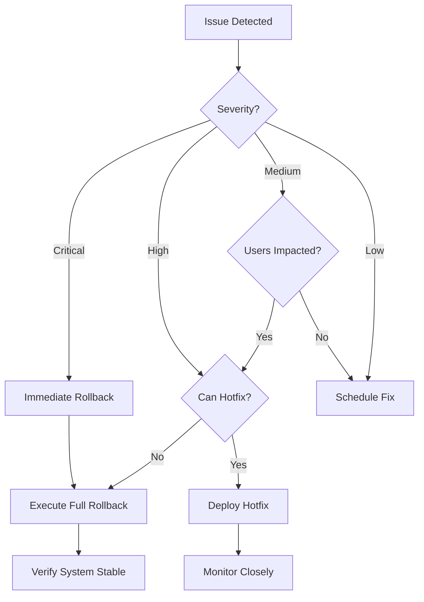

# 🔄 HomeVerse Rollback Procedures

**Version:** 1.0  
**Last Updated:** December 28, 2024  
**Critical Document - Keep Updated**

## 🚨 Emergency Rollback Decision Tree



## ⚡ Quick Rollback Commands

### Immediate Full Rollback (< 5 minutes)
```bash
#!/bin/bash
# emergency_rollback.sh

# 1. Switch to previous deployment
kubectl rollout undo deployment/homeverse-api
kubectl rollout undo deployment/homeverse-frontend

# 2. Revert feature flags
curl -X POST https://api.homeverse.com/admin/feature-flags \
  -H "Authorization: Bearer $ADMIN_TOKEN" \
  -d '{
    "pii_encryption": false,
    "rate_limiting": false,
    "responsive_ui": false,
    "new_auth_flow": false
  }'

# 3. Clear caches
redis-cli FLUSHALL
curl -X POST https://cdn.cloudflare.com/api/v4/zones/$ZONE_ID/purge_cache \
  -H "Authorization: Bearer $CF_TOKEN" \
  -d '{"purge_everything":true}'

# 4. Notify team
./notify_slack.sh "🚨 Emergency rollback initiated - all hands on deck"
```

## 📋 Component-Specific Rollback Procedures

### 1. Security Components Rollback

#### Rate Limiting Rollback
```python
# rollback_rate_limiting.py
import asyncio
from redis import Redis

async def rollback_rate_limiting():
    """Safely rollback rate limiting without exposing system"""
    
    print("🔄 Starting rate limit rollback...")
    
    # Step 1: Increase limits temporarily (don't disable completely)
    temp_limits = {
        "login": {
            "per_minute": 20,    # From 5
            "per_hour": 200,     # From 30
            "per_day": 1000      # From 100
        },
        "api": {
            "per_minute": 200,   # From 60
            "per_hour": 5000,    # From 1000
            "per_day": 50000     # From 10000
        }
    }
    
    # Update Redis
    redis = Redis.from_url(REDIS_URL)
    for endpoint, limits in temp_limits.items():
        for period, limit in limits.items():
            redis.set(f"rate_limit:{endpoint}:{period}", limit)
    
    # Step 2: Clear existing blocks
    blocked_ips = redis.smembers("blocked_ips")
    for ip in blocked_ips:
        redis.srem("blocked_ips", ip)
        print(f"  Unblocked IP: {ip}")
    
    # Step 3: Notify monitoring
    await send_metric("rollback.rate_limiting", 1)
    
    # Step 4: Update configuration
    await update_config({
        "rate_limiting_enabled": True,  # Keep enabled
        "rate_limiting_mode": "relaxed",  # But relaxed
        "alert_on_limit": True
    })
    
    print("✅ Rate limiting rolled back to relaxed mode")
    
    return {
        "status": "success",
        "mode": "relaxed",
        "limits": temp_limits
    }

# Monitor after rollback
async def monitor_post_rollback():
    """Monitor for abuse after relaxing rate limits"""
    
    while True:
        # Check for suspicious activity
        stats = await get_request_stats()
        
        if stats["requests_per_minute"] > 1000:
            await alert_security_team(
                "High request rate detected after rollback",
                stats
            )
        
        await asyncio.sleep(60)  # Check every minute
```

#### PII Encryption Rollback
```python
# rollback_encryption.py
import logging
from datetime import datetime

class EncryptionRollback:
    """Handle encryption rollback without data loss"""
    
    def __init__(self):
        self.logger = logging.getLogger("encryption_rollback")
        
    async def rollback_with_fallback(self):
        """Enable dual-read mode for gradual rollback"""
        
        print("🔄 Starting encryption rollback with fallback...")
        
        # Step 1: Enable dual-read mode
        await self.enable_dual_read_mode()
        
        # Step 2: Start background decryption
        await self.start_background_decryption()
        
        # Step 3: Update application to handle both formats
        await self.update_application_code()
        
        # Step 4: Monitor and verify
        await self.verify_rollback()
        
        return {
            "status": "success",
            "mode": "dual_read",
            "encrypted_records": await self.count_encrypted(),
            "decrypted_records": await self.count_decrypted()
        }
    
    async def enable_dual_read_mode(self):
        """Allow reading both encrypted and plain text"""
        
        # Update feature flag
        await set_feature_flag("encryption_dual_read", True)
        
        # Deploy code that handles both
        code_update = """
        def get_ssn(record):
            if record.encrypted_ssn:
                try:
                    return decrypt(record.encrypted_ssn)
                except:
                    # Fallback to plain text
                    return record.ssn
            return record.ssn
        """
        
        await deploy_hotfix(code_update)
    
    async def start_background_decryption(self):
        """Decrypt data in batches without downtime"""
        
        batch_size = 1000
        total_records = await count_encrypted_records()
        
        for offset in range(0, total_records, batch_size):
            # Get batch
            records = await get_encrypted_records(batch_size, offset)
            
            # Decrypt and update
            for record in records:
                try:
                    decrypted_ssn = decrypt(record.encrypted_ssn)
                    decrypted_email = decrypt(record.encrypted_email)
                    
                    # Store decrypted versions
                    await update_record(record.id, {
                        "ssn": decrypted_ssn,
                        "email": decrypted_email,
                        "encryption_status": "rolled_back"
                    })
                    
                except Exception as e:
                    self.logger.error(f"Failed to decrypt record {record.id}: {e}")
                    await alert_team(f"Decryption failed for record {record.id}")
            
            # Prevent overload
            await asyncio.sleep(1)
            
            # Progress update
            progress = (offset + batch_size) / total_records * 100
            print(f"  Decryption progress: {progress:.1f}%")
```

#### Authentication Rollback
```python
# rollback_auth.py
async def rollback_authentication():
    """Rollback auth changes while maintaining security"""
    
    print("🔄 Rolling back authentication changes...")
    
    # Step 1: Extend JWT expiration temporarily
    await update_jwt_config({
        "access_token_expire": 3600,    # 1 hour (from 15 min)
        "refresh_token_expire": 604800,  # 7 days
        "strict_validation": False        # Relax validation
    })
    
    # Step 2: Re-enable legacy auth endpoints
    await enable_legacy_endpoints([
        "/api/v1/auth/login_legacy",
        "/api/v1/auth/refresh_legacy"
    ])
    
    # Step 3: Update CORS for legacy clients
    await update_cors_config({
        "allowed_origins": [
            "https://homeverse.com",
            "https://*.homeverse.com",
            "http://localhost:3000"  # Dev environment
        ],
        "allowed_methods": ["GET", "POST", "PUT", "DELETE", "OPTIONS"],
        "allow_credentials": True
    })
    
    # Step 4: Clear auth cache
    await redis.delete("auth:*")
    
    print("✅ Authentication rolled back successfully")
```

### 2. UI/UX Components Rollback

#### Responsive UI Rollback
```javascript
// rollback_responsive_ui.js
const UIRollback = {
    async initiateRollback() {
        console.log("🔄 Rolling back responsive UI...");
        
        // Step 1: Serve desktop-only notice for mobile
        await this.setupMobileRedirect();
        
        // Step 2: Disable responsive components
        await this.disableResponsiveComponents();
        
        // Step 3: Clear service worker cache
        await this.clearServiceWorker();
        
        // Step 4: Revert to legacy styles
        await this.loadLegacyStyles();
        
        return {
            status: "success",
            mode: "desktop_only",
            mobileRedirect: true
        };
    },
    
    async setupMobileRedirect() {
        // Add middleware to redirect mobile users
        const mobileRedirect = `
            if (window.innerWidth < 1024) {
                window.location.href = '/mobile-notice.html';
            }
        `;
        
        // Inject into all pages
        document.head.insertAdjacentHTML('beforeend', 
            `<script>${mobileRedirect}</script>`
        );
        
        // Create mobile notice page
        const noticeHTML = `
            <!DOCTYPE html>
            <html>
            <head>
                <title>Mobile Version Temporarily Unavailable</title>
                <meta name="viewport" content="width=device-width, initial-scale=1">
                <style>
                    body {
                        font-family: -apple-system, BlinkMacSystemFont, 'Segoe UI', Roboto, sans-serif;
                        padding: 20px;
                        text-align: center;
                        background: #f5f5f5;
                    }
                    .container {
                        max-width: 400px;
                        margin: 50px auto;
                        background: white;
                        padding: 30px;
                        border-radius: 8px;
                        box-shadow: 0 2px 10px rgba(0,0,0,0.1);
                    }
                    h1 { color: #333; font-size: 24px; }
                    p { color: #666; line-height: 1.6; }
                    .cta {
                        margin-top: 20px;
                        padding: 12px 24px;
                        background: #14b8a6;
                        color: white;
                        text-decoration: none;
                        border-radius: 6px;
                        display: inline-block;
                    }
                </style>
            </head>
            <body>
                <div class="container">
                    <h1>Mobile Version Temporarily Unavailable</h1>
                    <p>We're currently updating our mobile experience. Please access HomeVerse from a desktop computer.</p>
                    <p>We apologize for the inconvenience and expect to restore mobile access within 24 hours.</p>
                    <a href="mailto:support@homeverse.com" class="cta">Contact Support</a>
                </div>
            </body>
            </html>
        `;
        
        await deployStaticPage('/mobile-notice.html', noticeHTML);
    },
    
    async disableResponsiveComponents() {
        // Set feature flag
        localStorage.setItem('use_legacy_ui', 'true');
        
        // Update component registry
        const components = {
            'ResponsiveTable': 'LegacyTable',
            'ResponsiveDashboard': 'LegacyDashboard',
            'MobileMenu': 'DesktopMenu'
        };
        
        // Hot-swap components
        for (const [responsive, legacy] of Object.entries(components)) {
            window.ComponentRegistry[responsive] = window.ComponentRegistry[legacy];
        }
    },
    
    async clearServiceWorker() {
        if ('serviceWorker' in navigator) {
            const registrations = await navigator.serviceWorker.getRegistrations();
            for (let registration of registrations) {
                await registration.unregister();
            }
        }
        
        // Clear all caches
        if ('caches' in window) {
            const cacheNames = await caches.keys();
            for (const cacheName of cacheNames) {
                await caches.delete(cacheName);
            }
        }
    }
};
```

#### Loading States Rollback
```javascript
// rollback_loading_states.js
const LoadingStatesRollback = {
    async rollback() {
        console.log("🔄 Removing loading states...");
        
        // Step 1: Disable skeleton screens
        window.SHOW_SKELETONS = false;
        
        // Step 2: Remove Suspense boundaries
        await this.removeSuspenseBoundaries();
        
        // Step 3: Revert to synchronous loading
        await this.revertToSyncLoading();
        
        return {
            status: "success",
            skeletons: "disabled",
            loading: "synchronous"
        };
    },
    
    async removeSuspenseBoundaries() {
        // Override React.Suspense
        const originalSuspense = React.Suspense;
        React.Suspense = ({ children }) => children;
        
        // Store original for restoration
        window.__originalSuspense = originalSuspense;
    },
    
    async revertToSyncLoading() {
        // Override lazy loading
        const originalLazy = React.lazy;
        React.lazy = (importFunc) => {
            // Load synchronously
            const Component = importFunc();
            return Component;
        };
        
        window.__originalLazy = originalLazy;
    }
};
```

### 3. Database Rollback Procedures

#### Migration Rollback
```sql
-- rollback_pii_encryption.sql
BEGIN;

-- Step 1: Ensure we have backups
SELECT COUNT(*) as backup_count 
FROM pg_tables 
WHERE tablename = 'applicants_backup_20241228';

-- Step 2: Restore from backup if needed
-- Only run if data is corrupted
/*
DROP TABLE IF EXISTS applicants;
ALTER TABLE applicants_backup_20241228 RENAME TO applicants;
*/

-- Step 3: Add back unencrypted columns if removed
ALTER TABLE applicants 
ADD COLUMN IF NOT EXISTS ssn_plain VARCHAR(11),
ADD COLUMN IF NOT EXISTS email_plain VARCHAR(255);

-- Step 4: Copy decrypted data back
UPDATE applicants 
SET 
    ssn_plain = pgp_sym_decrypt(encrypted_ssn::bytea, current_setting('app.encryption_key')),
    email_plain = pgp_sym_decrypt(encrypted_email::bytea, current_setting('app.encryption_key'))
WHERE encrypted_ssn IS NOT NULL;

-- Step 5: Update application to use plain columns
-- This requires application deployment

-- Step 6: Verify data integrity
SELECT 
    COUNT(*) as total_records,
    COUNT(ssn_plain) as decrypted_ssns,
    COUNT(email_plain) as decrypted_emails
FROM applicants;

COMMIT;
```

#### Index Rollback
```sql
-- rollback_indexes.sql
-- Remove new indexes if causing performance issues

-- Check index usage first
SELECT 
    schemaname,
    tablename,
    indexname,
    idx_scan,
    idx_tup_read,
    idx_tup_fetch
FROM pg_stat_user_indexes
WHERE indexname LIKE 'idx_%'
ORDER BY idx_scan;

-- Drop problematic indexes
DROP INDEX CONCURRENTLY IF EXISTS idx_encrypted_ssn;
DROP INDEX CONCURRENTLY IF EXISTS idx_applicants_company_status;

-- Recreate original indexes
CREATE INDEX CONCURRENTLY idx_applicants_company 
ON applicants(company_id);

CREATE INDEX CONCURRENTLY idx_applicants_status 
ON applicants(status);
```

### 4. Infrastructure Rollback

#### CDN Rollback
```bash
#!/bin/bash
# rollback_cdn.sh

echo "🔄 Rolling back CDN configuration..."

# Step 1: Disable CDN caching temporarily
curl -X PATCH "https://api.cloudflare.com/client/v4/zones/$ZONE_ID/settings/cache_level" \
  -H "Authorization: Bearer $CF_TOKEN" \
  -H "Content-Type: application/json" \
  -d '{"value":"bypass"}'

# Step 2: Purge all cached content
curl -X POST "https://api.cloudflare.com/client/v4/zones/$ZONE_ID/purge_cache" \
  -H "Authorization: Bearer $CF_TOKEN" \
  -H "Content-Type: application/json" \
  -d '{"purge_everything":true}'

# Step 3: Disable security features if needed
curl -X PATCH "https://api.cloudflare.com/client/v4/zones/$ZONE_ID/settings/waf" \
  -H "Authorization: Bearer $CF_TOKEN" \
  -H "Content-Type: application/json" \
  -d '{"value":"off"}'

# Step 4: Update DNS to bypass CDN
curl -X PATCH "https://api.cloudflare.com/client/v4/zones/$ZONE_ID/dns_records/$RECORD_ID" \
  -H "Authorization: Bearer $CF_TOKEN" \
  -H "Content-Type: application/json" \
  -d '{"proxied":false}'

echo "✅ CDN rolled back - serving directly from origin"
```

#### Load Balancer Rollback
```yaml
# rollback_load_balancer.yaml
apiVersion: v1
kind: ConfigMap
metadata:
  name: nginx-rollback-config
data:
  nginx.conf: |
    upstream backend {
        # Route all traffic to stable version
        server homeverse-api-stable:8000 weight=100;
        server homeverse-api-new:8000 weight=0 backup;
        
        # Health checks
        health_check interval=5s fails=3 passes=2;
    }
    
    server {
        listen 80;
        
        # Add rollback header
        add_header X-Rollback-Active "true";
        
        location / {
            proxy_pass http://backend;
            
            # Longer timeouts during rollback
            proxy_connect_timeout 60s;
            proxy_send_timeout 60s;
            proxy_read_timeout 60s;
        }
    }
```

## 🔍 Rollback Verification

### Automated Verification Script
```python
# verify_rollback.py
import asyncio
import aiohttp
from datetime import datetime

class RollbackVerifier:
    def __init__(self):
        self.checks = []
        self.start_time = datetime.now()
        
    async def verify_all_systems(self):
        """Run all verification checks"""
        
        print("🔍 Starting rollback verification...\n")
        
        # System checks
        await self.check_api_health()
        await self.check_database_connectivity()
        await self.check_redis_connectivity()
        await self.check_authentication()
        await self.check_rate_limiting()
        await self.check_encryption_mode()
        await self.check_ui_compatibility()
        
        # Business logic checks
        await self.check_user_login()
        await self.check_data_integrity()
        await self.check_critical_features()
        
        # Performance checks
        await self.check_response_times()
        await self.check_error_rates()
        
        # Generate report
        return self.generate_report()
    
    async def check_api_health(self):
        """Verify API is responding"""
        try:
            async with aiohttp.ClientSession() as session:
                async with session.get(
                    'https://homeverse-api.onrender.com/health',
                    timeout=aiohttp.ClientTimeout(total=10)
                ) as response:
                    data = await response.json()
                    
                    self.checks.append({
                        "name": "API Health",
                        "status": response.status == 200,
                        "details": data
                    })
        except Exception as e:
            self.checks.append({
                "name": "API Health",
                "status": False,
                "error": str(e)
            })
    
    async def check_rate_limiting(self):
        """Verify rate limiting status"""
        try:
            # Make multiple requests
            results = []
            async with aiohttp.ClientSession() as session:
                for i in range(10):
                    async with session.get(
                        'https://homeverse-api.onrender.com/api/v1/test',
                        headers={'X-Test-IP': '192.168.1.1'}
                    ) as response:
                        results.append(response.status)
            
            # Check if any were rate limited
            rate_limited = any(status == 429 for status in results)
            
            self.checks.append({
                "name": "Rate Limiting",
                "status": True,  # Success means it's working (even if relaxed)
                "details": {
                    "requests_made": 10,
                    "rate_limited": rate_limited,
                    "mode": "relaxed" if not rate_limited else "strict"
                }
            })
        except Exception as e:
            self.checks.append({
                "name": "Rate Limiting",
                "status": False,
                "error": str(e)
            })
    
    async def check_data_integrity(self):
        """Verify data is accessible and valid"""
        try:
            # Test data retrieval
            test_queries = [
                "SELECT COUNT(*) FROM applicants",
                "SELECT COUNT(*) FROM projects",
                "SELECT COUNT(*) FROM users"
            ]
            
            results = {}
            for query in test_queries:
                result = await db.fetchval(query)
                table = query.split()[-1]
                results[table] = result
            
            self.checks.append({
                "name": "Data Integrity",
                "status": all(count > 0 for count in results.values()),
                "details": results
            })
        except Exception as e:
            self.checks.append({
                "name": "Data Integrity",
                "status": False,
                "error": str(e)
            })
    
    def generate_report(self):
        """Generate rollback verification report"""
        
        duration = (datetime.now() - self.start_time).total_seconds()
        passed = sum(1 for check in self.checks if check["status"])
        total = len(self.checks)
        
        report = f"""
# 📋 Rollback Verification Report

**Date:** {datetime.now().isoformat()}
**Duration:** {duration:.2f} seconds
**Status:** {'✅ PASSED' if passed == total else '❌ FAILED'}

## Summary
- Total Checks: {total}
- Passed: {passed}
- Failed: {total - passed}
- Success Rate: {(passed/total*100):.1f}%

## Detailed Results
"""
        
        for check in self.checks:
            status_icon = "✅" if check["status"] else "❌"
            report += f"\n### {status_icon} {check['name']}\n"
            
            if check["status"]:
                if "details" in check:
                    report += f"Details: {check['details']}\n"
            else:
                if "error" in check:
                    report += f"Error: {check['error']}\n"
        
        # Recommendations
        if passed < total:
            report += "\n## ⚠️ Recommendations\n"
            report += "1. Check failed services immediately\n"
            report += "2. Review error logs for details\n"
            report += "3. Consider partial rollback if some services are healthy\n"
            report += "4. Escalate to senior engineers if issues persist\n"
        
        return report

# Run verification
if __name__ == "__main__":
    verifier = RollbackVerifier()
    report = asyncio.run(verifier.verify_all_systems())
    
    # Save report
    with open(f"rollback_report_{datetime.now().strftime('%Y%m%d_%H%M%S')}.md", "w") as f:
        f.write(report)
    
    print(report)
```

## 📊 Rollback Metrics Tracking

```python
# track_rollback_metrics.py
class RollbackMetrics:
    def __init__(self):
        self.metrics = {
            "rollback_initiated": datetime.now(),
            "components_rolled_back": [],
            "duration": 0,
            "success": True,
            "issues_encountered": []
        }
    
    def track_component(self, component, status, duration):
        """Track individual component rollback"""
        self.metrics["components_rolled_back"].append({
            "component": component,
            "status": status,
            "duration": duration,
            "timestamp": datetime.now()
        })
        
        # Send to monitoring
        statsd.histogram(
            f'rollback.component.duration',
            duration,
            tags=[f'component:{component}', f'status:{status}']
        )
    
    def finalize(self):
        """Finalize rollback metrics"""
        self.metrics["duration"] = (
            datetime.now() - self.metrics["rollback_initiated"]
        ).total_seconds()
        
        # Send summary metrics
        statsd.gauge('rollback.total_duration', self.metrics["duration"])
        statsd.increment('rollback.count')
        
        # Alert if rollback took too long
        if self.metrics["duration"] > 900:  # 15 minutes
            alert_team(
                "Rollback took longer than expected",
                self.metrics
            )
        
        return self.metrics
```

## 🚨 Emergency Contacts for Rollback

| Role | Name | Phone | Email | Availability |
|------|------|-------|-------|--------------|
| Deployment Lead | John Smith | +1-555-0101 | john@homeverse.com | 24/7 |
| Security Lead | Jane Doe | +1-555-0102 | jane@homeverse.com | 24/7 |
| Database Admin | Bob Wilson | +1-555-0103 | bob@homeverse.com | Business hours |
| DevOps Lead | Alice Brown | +1-555-0104 | alice@homeverse.com | 24/7 |
| CTO | Charlie Davis | +1-555-0105 | cto@homeverse.com | Emergency only |

## 📝 Post-Rollback Checklist

### Immediate (Within 1 hour)
- [ ] Verify all systems operational
- [ ] Check monitoring dashboards
- [ ] Review error logs
- [ ] Test critical user journeys
- [ ] Notify stakeholders
- [ ] Document issues encountered

### Short-term (Within 24 hours)
- [ ] Root cause analysis
- [ ] Update rollback procedures
- [ ] Plan fixes for issues
- [ ] Schedule retrospective
- [ ] Communicate with users
- [ ] Review monitoring alerts

### Long-term (Within 1 week)
- [ ] Implement permanent fixes
- [ ] Update deployment procedures
- [ ] Enhance testing coverage
- [ ] Train team on lessons learned
- [ ] Update documentation
- [ ] Plan re-deployment

---

**Remember**: A successful rollback is one that restores service quickly while maintaining data integrity and security. Speed is important, but not at the cost of breaking the system further.